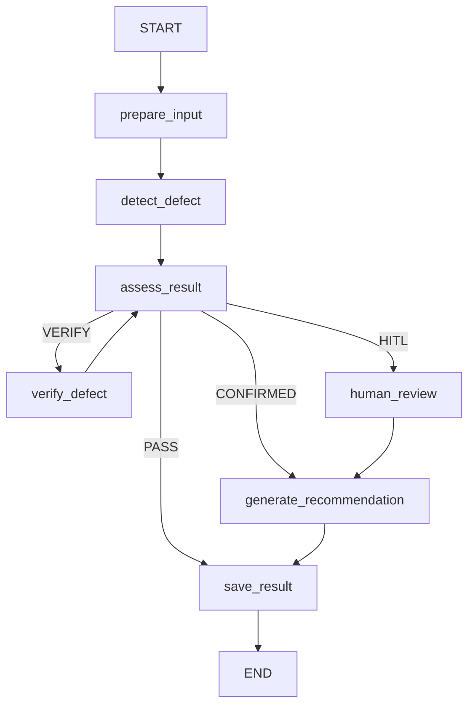

# Visual QC Agent — LangGraph workflow và dữ liệu

Tài liệu này là kịch bản kỹ thuật chính để demo baseline MVP. Hệ thống dùng
LangGraph thật để điều phối, nhưng detector/verifier vẫn là mock adapter; kết quả
không phải phê duyệt sản xuất.

## 1. Flow tổng thể



Mermaid phía trên là bản dễ đọc. API `GET /agent/graph` và script
`python -m scripts.export_agent_graph` dùng
`graph.get_graph().draw_mermaid()` để sinh diagram thực tế từ code. Syntax được
lưu tại `agent_flow.mmd`.

## 2. QCState — bộ nhớ chung của Agent

`agent/graph/state.py` định nghĩa `QCState` bằng `TypedDict`. Mỗi node chỉ đọc state
đầu vào và trả phần state cần cập nhật. Checkpointer lưu snapshot theo `thread_id`.

| Nhóm | Trường chính | Vai trò |
|---|---|---|
| Identity | `inspection_id`, `thread_id`, `vehicle_id` | Truy vết một inspection và phiên graph |
| Evidence | `image_url`, `image_paths`, `camera_id`, `panel` | Nguồn ảnh và vị trí kiểm tra |
| CV output | `defect_detected`, `defect_type`, `confidence`, `bbox`, `segmentation_result` | Contract tương lai cho YOLO/segmentation |
| Assessment | `severity`, `decision`, `reason`, `assessment_route` | Kết quả rule và nhãn conditional edge |
| Verify | `verify_count`, `verify_result`, `max_retries` | Điều khiển vòng lặp an toàn |
| HITL | `human_required`, `human_decision` | Dữ liệu pause/resume của QC |
| Output | `recommendation_code`, `recommendation`, `final_status` | Mã audit, câu hành động dễ đọc và trạng thái routing cuối |
| Observability | `execution_trace`, `error`, `retry_count` | Timeline từng node và metadata lỗi |

`execution_trace` dùng reducer append, nên lần thứ hai chạy `assess_result` không
ghi đè lần đầu; UI có thể hiển thị đầy đủ vòng lặp.

## 3. Trách nhiệm của từng node

| Node | Công việc | Cơ chế |
|---|---|---|
| `prepare_input` | Kiểm tra có ảnh, khởi tạo verify/retry/HITL | Python deterministic |
| `detect_defect` | Gọi `DetectorService`; hiện trả mock bbox/confidence | Mock adapter |
| `assess_result` | Áp threshold và chọn PASS/CONFIRMED/VERIFY/HITL | Python deterministic |
| `verify_defect` | Gọi `VerifierService` cho second pass | Mock adapter |
| `human_review` | Gọi `interrupt()` và nhận quyết định khi resume | LangGraph HITL |
| `generate_recommendation` | Chọn phương pháp và trạng thái route bằng policy | Python deterministic |
| `save_result` | Lưu state cuối qua `QCRepository` | SQLite repository |

`ReasoningService` hiện là bộ định dạng lý do deterministic. Baseline không gọi mô hình
ngôn ngữ bên ngoài; detector threshold, vòng an toàn và quyền release đều có thể audit.

## 4. Conditional routing và verify loop

`assess_result` áp dụng thứ tự rule:

1. Không có defect → `PASS` → lưu và release.
2. `verify_result=CONFIRMED` → `CONFIRMED` → sinh phương pháp.
3. Verify vẫn `UNCERTAIN` và `verify_count >= 2` → `HITL`.
4. Confidence `>= 0.85` → xác nhận tự động.
5. Confidence từ `0.50` đến dưới `0.85` → `VERIFY`.
6. Confidence dưới `0.50` → `HITL` fail-safe.

`verify_defect → assess_result` là edge quay lại. Guard hai lần đảm bảo graph không
thể loop vô hạn. Một verifier thật có thể dùng camera thứ hai, crop độ phân giải cao
hoặc model ensemble nhưng phải giữ contract `verify_count/verify_result`.

## 5. HITL thật: pause và resume

Khi đến `human_review`, LangGraph ghi checkpoint rồi `interrupt()` trả control về
FastAPI. Response có `status=INTERRUPTED`, state hiện tại và action hợp lệ. Không có
recommendation cuối nào được lưu trước khi người dùng quyết định.

```python
from langgraph.types import Command

result = graph.invoke(
    Command(resume={
        "action": "APPROVE",
        "reviewer": "qc-inspector-01",
        "reason": "Defect confirmed under controlled lighting.",
    }),
    config={"configurable": {"thread_id": thread_id}},
)
```

Phải resume đúng `thread_id`. Vì LangGraph chạy lại node từ đầu sau interrupt, phần
code trước `interrupt()` không được chứa side effect không-idempotent.

## 6. Persistence và các bảng SQLite

Database mặc định: `data/visual_qc.db`.

| Bảng | Nội dung |
|---|---|
| `inspections` | VIN/vehicle model/station/ảnh nguồn/status |
| `defects` | YOLO-style class, confidence, camera, bbox, model metadata |
| `classifications` | panel, material, GD&T mock, tolerance, measurement, severity |
| `decisions` | recommendation, action code, route, policy refs, method steps |
| `hitl_reviews` | reviewer, action, original/final recommendation, reason |
| `workflow_runs` | JSON audit của baseline workflow cũ đang giữ tương thích API |
| `agent_graph_runs` | Kết quả cuối của LangGraph theo `thread_id` |

`agent_graph_runs` gồm:

| Cột | Ý nghĩa |
|---|---|
| `thread_id` (PK) | ID checkpoint/resume |
| `inspection_id` | ID nghiệp vụ của inspection |
| `vehicle_id` | Xe được kiểm tra |
| `status` | `PASS`, `HOLD_FOR_REWORK`, `HOLD_FOR_QC`, ... |
| `state_json` | Toàn bộ `QCState` cuối để audit/demo |
| `updated_at` | Thời gian upsert gần nhất |

`InMemorySaver` hiện lưu checkpoint đang chạy/HITL; SQLite repository lưu kết quả
cuối. Production thay `InMemorySaver` bằng `PostgresSaver` và gọi `setup()` một lần.
Builder đã nhận checkpointer qua dependency injection nên node không phải sửa.

## 7. API demo

```powershell
$body = @{
  vehicle_id = "CAR-DEMO-01"
  image_url = "/assets/train/example.jpg"
  camera_id = "cam-fns-01"
  panel = "door_panel"
  mock_scenario = "verify_uncertain"
} | ConvertTo-Json

$run = Invoke-RestMethod -Method Post -Uri http://127.0.0.1:8000/inspections `
  -ContentType "application/json" -Body $body

$resume = @{
  action = "APPROVE"
  reviewer = "qc-demo"
  reason = "Confirmed under controlled lighting"
} | ConvertTo-Json

Invoke-RestMethod -Method Post `
  -Uri "http://127.0.0.1:8000/inspections/$($run.thread_id)/resume" `
  -ContentType "application/json" -Body $resume
```

Các scenario sẵn có: `no_defect`, `high_confidence`, `medium_confirmed`,
`verify_uncertain`, `low_confidence`.

## 8. Thay mock bằng thành phần thật

1. Tạo adapter mới implement `DetectorService.detect(state)` và map output YOLO
   (`xyxy`, class, confidence) hoặc segmentation vào `QCState`.
2. Inject adapter vào `build_qc_graph`; không nhúng model trực tiếp vào node.
3. Tạo verifier second-pass theo camera/model được nhà máy phê duyệt.
4. Thay rule demo bằng policy/GD&T/work instruction có version và approval.
5. Giữ recommendation trong catalog policy có version; không sinh tự do phương pháp sửa chữa.

## 9. Kịch bản demo ngắn

1. Mở **Kiểm tra bằng Agent**, chọn ảnh xe không lỗi: trace đi thẳng đến PASS.
2. Chọn ảnh xước cần xác minh: chỉ ra `verify_defect` và hai lần `assess_result`.
3. Chọn ảnh mơ hồ: graph chạy verify hai lần rồi dừng tại HITL.
4. Nhấn xác nhận hoặc từ chối: cùng thread tiếp tục đến recommendation và save.
5. Mở Mermaid source để chứng minh UI đang phản ánh graph thật, không phải flow vẽ tay.
