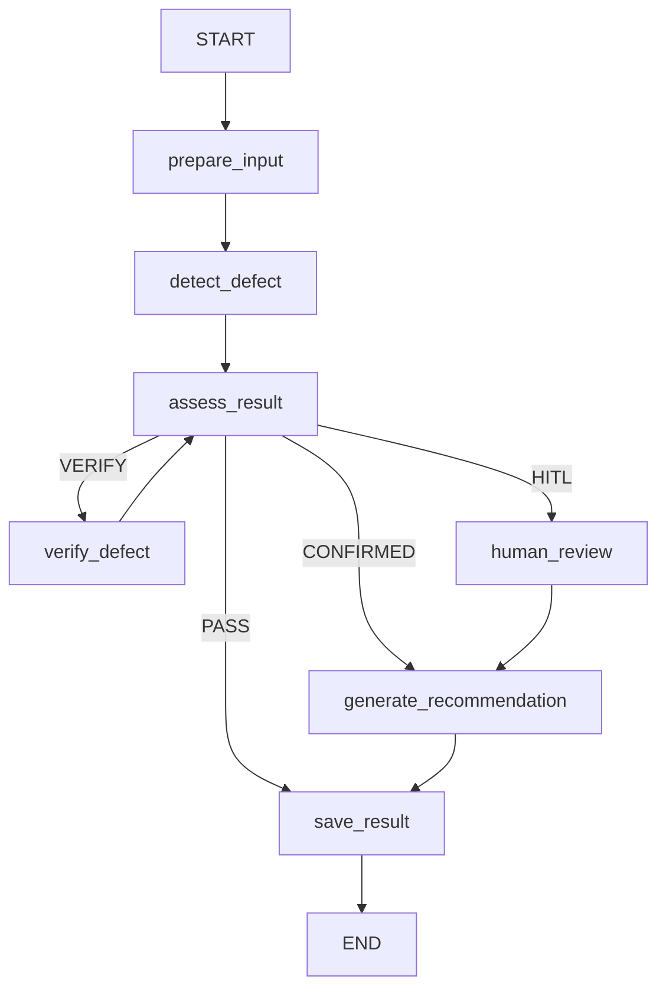

# Visual QC Agent Flow

Hệ thống hiện chạy upload-only với model segmentation local `data/best.pt`.
Frontend không cung cấp class, confidence, bbox hoặc mask; toàn bộ detection đến
từ model và được LangGraph điều phối bằng rule deterministic.

## Runtime services

| Thành phần | Implementation hiện tại |
| --- | --- |
| Detector | `LocalYoloSegmentationDetector(data/best.pt)` |
| Verifier | `ModelVerifier`, chạy second pass và kiểm tra class/confidence ổn định |
| Reasoning | Deterministic Python formatter, không gọi LLM |
| Checkpointer | `InMemorySaver` cho pause/resume HITL |
| Audit | SQLite table `agent_graph_runs` |
| Evidence | `data/uploads/<inspection_id>/original.*` |

## Luồng upload

1. QC tải JPEG/PNG lên `POST /inspections/from-image`.
2. Backend kiểm tra content type, dung lượng và xác thực ảnh bằng Pillow.
3. Ảnh được lưu trong `data/uploads` và hash SHA-256 được đưa vào `QCState`.
4. `best.pt` trả class, confidence, bbox và segmentation polygon.
5. `assess_result` route theo threshold. Verify tối đa hai lần để tránh loop vô hạn.
6. Kết quả không rõ dừng tại `human_review` bằng `interrupt()`.
7. Kết quả cuối được lưu vào `agent_graph_runs`; UI hiển thị node trace, ảnh
   evidence, mã lỗi, số đo pilot và hành động cuối.
8. Case bị `interrupt()` xuất hiện trong Hàng đợi QC dưới dạng thẻ kiểm duyệt có
   ảnh và lý do cần người xử lý. Sau `Command(resume=...)`, bản ghi hoàn tất được
   chuyển sang Lịch sử.

## Ranh giới mock

Runtime mặc định dùng `DETECTOR_PROVIDER=local_yolo`. `MockDetector` và
`MockVerifier` chỉ còn là test doubles được inject trong automated tests để kiểm
tra các nhánh LangGraph nhanh và deterministic; chúng không cung cấp dữ liệu cho
giao diện production.

## Quality trend alert

Agent đọc bản ghi mới nhất của mỗi xe trong 24 giờ và nhóm theo
`defect_type + zone_name + camera_id`:

- từ 3 xe: `WARNING`, yêu cầu QC kiểm tra công đoạn phía trước;
- từ 5 xe: `CRITICAL`;
- UI hiển thị mã lỗi liên quan và tối đa bốn ảnh không trùng của các lần phát hiện;
- cảnh báo chỉ giữ tín hiệu chính, hành động ngay, kết luận Agent và điều kiện đóng;
- báo cáo Word tải tại `GET /api/quality-alerts/report.docx`.
