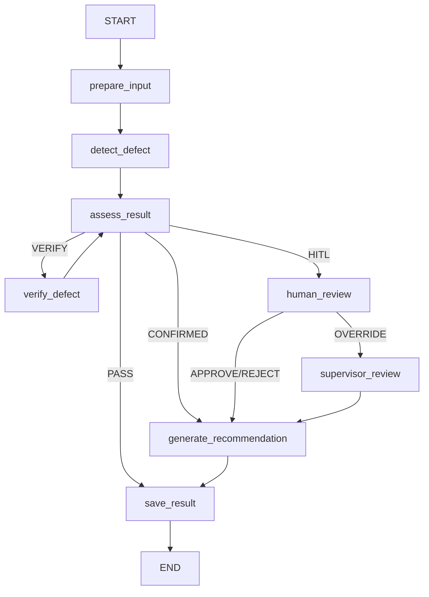

# Visual QC Agent Flow

Hệ thống chạy upload-only với model segmentation local `data/best.pt`.
Frontend không cung cấp class, confidence, bbox hoặc mask; toàn bộ detection đến
từ model và được LangGraph điều phối; Groq LLM (hoặc `DeterministicReasoningService`
khi chạy rule-based) phân loại và ra quyết định trong giới hạn catalog/policy được
backend kiểm soát.

Không còn node xác minh thị giác bằng Multimodal LLM (`multimodal_verify`) trong
runtime — bước này đã bị bỏ khỏi baseline (xem `docs/PRD.md` §7.3, v1.4).
YOLO segmentation + Geometry Processor deterministic là evidence duy nhất trước
`assess_result`.

## HITL hai cấp (Inspector → Supervisor)

- **`human_review`** (mọi role đã đăng nhập có thể mở case được phân công) chỉ
  chấp nhận 3 hành động: `APPROVE` (xác nhận lỗi AI gắn cờ là thật →
  `final_status = FAIL`), `REJECT` (bác bỏ lỗi, không có defect thật →
  `final_status = PASS` ngay, không có bước tái kiểm tra riêng), `OVERRIDE`
  (đề xuất một hành động tùy biến, bắt buộc chuyển cấp).
- **`supervisor_review`** chỉ chạy khi `human_review` chọn `OVERRIDE`, và chỉ
  role `QC_SUPERVISOR` mới resume được (`backend/app/langgraph_api.py` trả 403
  nếu sai role). Chỉ nhận `APPROVE` (giữ đề xuất của Inspector → `FAIL`) hoặc
  `REJECT` (bỏ đề xuất, quay lại quyết định QC Rules chuẩn theo `defect_type`).
- `final_status` chỉ có hai giá trị: `PASS` hoặc `FAIL`. Không còn
  `HOLD_FOR_QC`/`HOLD_FOR_REWORK`/`HUMAN_OVERRIDE_APPLIED`/trạng thái tái kiểm
  tra (`REINSPECT`) riêng — mọi FAIL, dù tự động hay qua HITL, đều là một giá
  trị duy nhất và luôn đi thẳng đến Rework.

## Runtime services

| Thành phần | Implementation hiện tại |
| --- | --- |
| Detector | `LocalYoloSegmentationDetector(data/best.pt)` (luôn phải được inject thật khi build graph — không còn detector giả trong runtime path) |
| Verifier | `ModelVerifier`, chạy second pass và kiểm tra class/confidence ổn định |
| Reasoning | Groq LLM phân loại và ra quyết định; backend validate schema, catalog và policy. `DeterministicReasoningService` dùng cho test/rule-based mode |
| Checkpointer | `InMemorySaver` cho pause/resume HITL |
| Audit | PostgreSQL/Supabase table `agent_graph_runs` |
| Evidence | S3/MinIO object storage (`data/uploads` chỉ là scratch cục bộ trước khi upload — xem `docs/API_CONTRACT.md` §4) |

## Luồng upload

1. QC tải JPEG/PNG lên `POST /inspections/from-image`.
2. Backend kiểm tra content type, dung lượng và xác thực ảnh bằng Pillow.
3. Ảnh được hash SHA-256 và đưa vào `QCState`, đồng thời lưu vào S3/MinIO.
4. `best.pt` trả class, confidence, bbox và segmentation polygon.
5. `assess_result` route theo threshold. Verify tối đa hai lần để tránh loop vô hạn.
6. Kết quả không rõ dừng tại `human_review` (và có thể `supervisor_review`) bằng `interrupt()`.
7. Kết quả cuối được lưu vào `agent_graph_runs`; UI hiển thị node trace, ảnh
   evidence, mã lỗi, số đo pilot và hành động cuối.
8. Case bị `interrupt()` xuất hiện trong Hàng đợi QC dưới dạng thẻ kiểm duyệt có
   ảnh và lý do cần người xử lý. Sau `Command(resume=...)`, bản ghi hoàn tất được
   chuyển sang Lịch sử.

## Ranh giới test double

Runtime luôn dùng detector/verifier/repository thật khi build graph
(`agent/graph/builder.py` không còn fallback mock). Test double (nếu có) chỉ
tồn tại trong `tests/` để kiểm tra các nhánh LangGraph nhanh và deterministic;
chúng không cung cấp dữ liệu cho giao diện production.

## Quality trend alert

Agent đọc bản ghi mới nhất của mỗi xe trong 24 giờ và nhóm theo
`defect_type + zone_name + camera_id`:

- từ 3 xe: `WARNING`, yêu cầu QC kiểm tra công đoạn phía trước;
- từ 5 xe: `CRITICAL`;
- UI hiển thị mã lỗi liên quan và tối đa bốn ảnh không trùng của các lần phát hiện;
- cảnh báo chỉ giữ tín hiệu chính, hành động ngay, kết luận Agent và điều kiện đóng;
- báo cáo Word tải tại `GET /api/quality-alerts/report.docx`.
