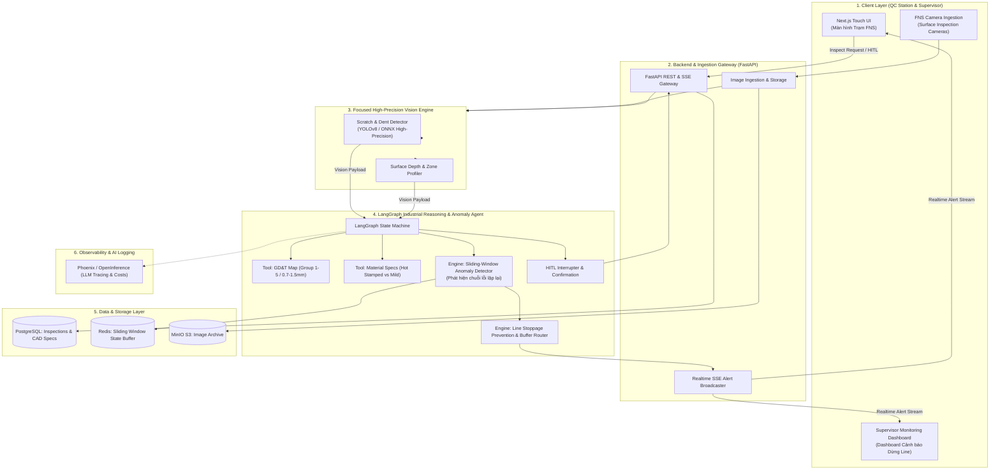
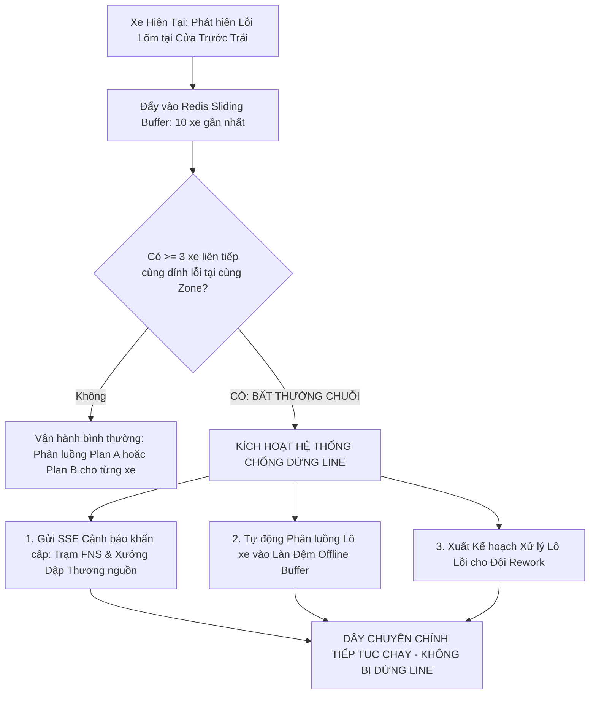

# Architecture Document — Visual QC Agent
## Team 235 — Automotive Quality Control & Intelligent Vehicle Routing (FNS Line)

---

## 1. System Overview

**Visual QC Agent** là hệ thống AI Agent kiểm định ngoại quan chuyên sâu tập trung vào khuyết tật **Xước (Scratch)** và **Lõm/Móp (Dent)** trên thân vỏ ô tô tại trạm **FNS (Finish Line)**.

Hệ thống sở hữu hai trụ cột năng lực:
1. **Kiểm định & Phân luồng Xe Đơn lẻ (Individual Vehicle QC & Actionable Routing):** Sử dụng mô hình thị giác máy tính độ chính xác cao trích xuất tọa độ, diện tích và độ sâu khuyết tật, kết hợp **LangGraph Industrial Reasoning Engine** tra cứu dung sai **GD&T (Group 1–5)** và **Vật liệu (Thép dập nóng vs Thép thường)** để ra phán quyết tức thì: **Phương án A (Buffing 3 phút $\rightarrow$ Cho chạy thử)** hoặc **Phương án B (HOLD $\rightarrow$ Cấm chạy thử $\rightarrow$ Chuyển Rework)**.
2. **Giám sát Bất thường Chuỗi & Chống Dừng Dây Chuyền (Systemic Anomaly & Line Stoppage Prevention):** Sử dụng Sliding-Window Buffer phân tích dữ liệu các xe liên tiếp. Khi phát hiện cụm lỗi lặp lại tại cùng tọa độ trên nhiều xe, Agent lập tức phát cảnh báo sớm nguyên nhân gốc rễ lên xưởng thượng nguồn (Xưởng Dập / Xưởng Hàn) và tự động kích hoạt điều phối vào làn đệm (Offline Buffer) để **ngăn chặn hoàn toàn rủi ro dừng dây chuyền (Prevent Line Stoppage)**.

---

## 2. System Architecture Diagram

---

## 3. Detailed Component Breakdown

### 3.1. High-Precision Vision Engine (Tập trung Xước & Lõm)
- **Mô hình cốt lõi:** YOLOv8 / ONNX Runtime tối ưu hóa chuyên sâu cho 2 lớp nhãn khuyết tật: `scratch` và `dent`.
- **Đầu ra:** Bounding Box chuẩn xác, độ sâu móp ước tính (`estimated_depth_mm`), diện tích tổn thương và ánh xạ vào vùng thân vỏ (`zone_name`).
- **Ưu điểm:** Bằng cách tập trung vào 2 lỗi cốt lõi, mô hình đạt độ chính xác phát hiện (Precision/Recall) cao vượt trội $>90\%$, loại bỏ hoàn toàn các trường hợp báo động giả (False Positives).

### 3.2. LangGraph State Machine (`src/agents/`)
- **Luồng xử lý Node:**
  1. `ingest_vision_node`: Nhận dữ liệu phát hiện xước/móp từ CV.
  2. `map_gdt_node`: Tra cứu dung sai GD&T theo zone ($0.7\text{mm} - 1.5\text{mm}$).
  3. `map_material_node`: Tra cứu loại vật liệu (Thép thường vs Thép dập nóng).
  4. `severity_rank_node`: Xếp rank theo ma trận PSLAWBCD.
  5. `routing_node`: Đưa ra phán quyết phân luồng cá nhân (Plan A: Buffing 3m $\rightarrow$ Chạy thử vs Plan B: HOLD $\rightarrow$ Cấm chạy thử $\rightarrow$ Rework).
  6. `systemic_anomaly_node` *(Tính năng Đột phá)*:
     - Đọc trạng thái chuỗi xe từ Redis Sliding-Window Buffer.
     - Kiểm tra điều kiện bất thường chuỗi ($\ge 3$ xe liên tiếp cùng dính lỗi tại một tọa độ).
     - Dự đoán nguyên nhân thiết bị thượng nguồn (Khuôn dập xưởng dập / Tay gắp robot).
     - Phát lệnh điều phối làn đệm và phát cảnh báo SSE để **chống dừng dây chuyền (Prevent Line Stoppage)**.
  7. `hitl_node`: Cho phép kiểm định viên xác nhận hoặc can thiệp.
  8. `generate_report_node`: Lưu trữ và đẩy báo cáo vào hệ thống.

---

## 4. Sliding-Window Anomaly Detection Logic

---

## 5. Deployment Architecture & Tech Stack

| Thành phần | Công nghệ | Vai trò |
| :--- | :--- | :--- |
| **Frontend UI** | Next.js 14, Tailwind CSS, SSE | Giao diện cảm ứng trạm FNS & Dashboard cảnh báo bất thường |
| **Backend API** | FastAPI, Uvicorn, Pydantic v2 | API Gateway, điều phối luồng và streaming realtime |
| **Vision Inference** | PyTorch, YOLOv8, ONNX Runtime | Nhận dạng siêu chuẩn xác Xước & Lõm ($< 30\text{ms}$) |
| **Agent Reasoning** | LangGraph, OpenAI / Gemini | Lập luận GD&T, vật liệu và phân tích bất thường chuỗi |
| **State Buffer & DB** | Redis, PostgreSQL, MinIO | Lưu trữ cửa sổ trượt (Sliding Window) & hình ảnh |
| **LLM Tracing** | Arize Phoenix | Theo dõi token cost, tool call latency và log quyết định |
