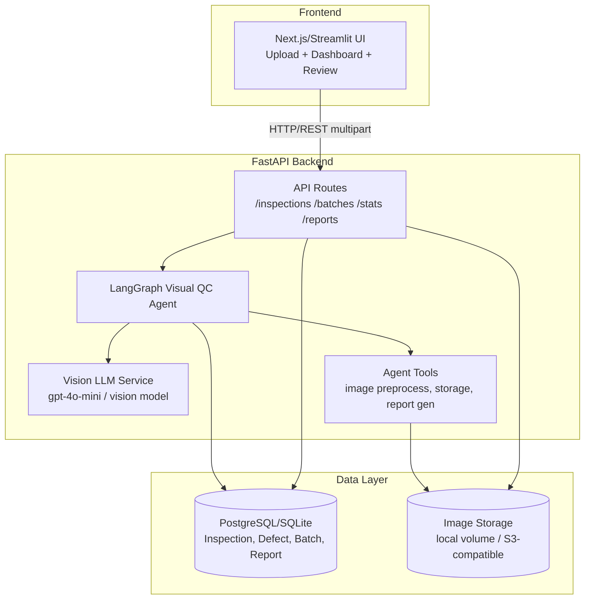
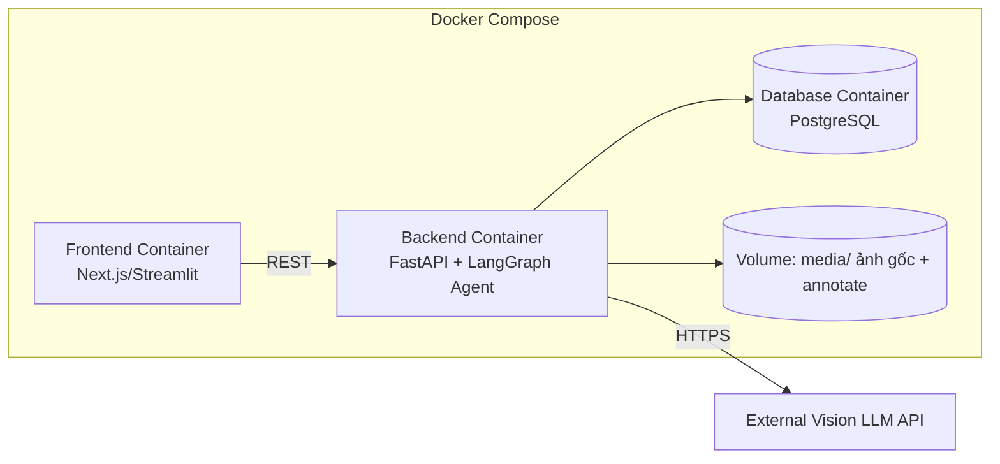

# Architecture Document

## System Overview

Visual QC Agent là hệ thống nhận ảnh sản phẩm từ trạm kiểm tra QC (qua API upload đơn lẻ hoặc theo lô), dùng một LangGraph agent điều phối vision LLM để phát hiện – phân loại – khoanh vùng lỗi, áp dụng luật quyết định để phân loại sản phẩm Pass/Fail/Needs Review, lưu kết quả vào database và cung cấp API thống kê + báo cáo theo lô. Backend FastAPI expose REST API; frontend (Next.js/Streamlit) hiển thị kết quả kiểm tra và dashboard thống kê.

## Architecture Diagram



## Components

### 1. Frontend (Next.js/Streamlit)
- **Purpose:** Cho phép QC Operator upload ảnh/batch, xem kết quả tức thời (Pass/Fail/Review với bbox overlay); cho Supervisor xem dashboard thống kê và tải báo cáo; cho Reviewer xử lý case Needs Review.
- **Key Features:** Upload đơn/batch (drag & drop), xem ảnh với bounding box lỗi vẽ chồng lên, bảng thống kê (Pass/Fail/Review count, top defect types), nút tải report CSV/JSON, màn hình review (approve/override quyết định).
- **State Management:** React Query/SWR (Next.js) để fetch & cache API; state cục bộ cho form upload. (Nếu dùng Streamlit: session_state đơn giản, phù hợp MVP nhanh.)

### 2. Backend (FastAPI)
- **Purpose:** Expose REST API để nhận ảnh, kích hoạt agent xử lý, trả kết quả, phục vụ truy vấn thống kê/báo cáo.
- **API Design:** RESTful, JSON responses, multipart/form-data cho upload ảnh.
- **Authentication:** MVP không bắt buộc; có thể thêm API key đơn giản qua header (`X-API-Key`) nếu cần phân biệt trạm/operator.

**Endpoints đề xuất:**

| Method | Path | Mô tả |
|---|---|---|
| POST | `/inspections` | Upload 1 ảnh, xử lý đồng bộ, trả kết quả inspection |
| POST | `/batches` | Upload nhiều ảnh (hoặc metadata trỏ tới thư mục), tạo batch, xử lý bất đồng bộ (BackgroundTasks) |
| GET | `/batches/{batch_id}` | Trạng thái batch (queued/processing/done) + danh sách inspection_id |
| GET | `/inspections/{inspection_id}` | Chi tiết 1 kết quả inspection |
| GET | `/batches/{batch_id}/results` | Danh sách toàn bộ kết quả inspection trong batch |
| GET | `/batches/{batch_id}/report?format=json\|csv` | Sinh/lấy batch report |
| GET | `/stats` | Thống kê tổng hợp (query params: `from`, `to`, `batch_id`) |
| PATCH | `/inspections/{inspection_id}/review` | Reviewer xác nhận/đảo quyết định (NEEDS_REVIEW → PASS/FAIL) |
| GET | `/health` | Health check |

### 3. AI Agent (LangGraph)

- **Agent Type:** Custom pipeline dạng linear-with-branch (không phải ReAct tự do) — phù hợp vì quy trình QC có thứ tự cố định, cần tính dự đoán được (deterministic hơn) và dễ audit.

- **State schema (`src/agents/state.py`)**:

```python
from __future__ import annotations
from typing import TypedDict, Literal, Optional


class Defect(TypedDict):
    defect_type: str
    severity: Literal["Minor", "Major", "Critical"]
    confidence: float
    bbox: dict  # {"x": float, "y": float, "width": float, "height": float}


class AgentState(TypedDict, total=False):
    inspection_id: str
    batch_id: Optional[str]
    image_path: str          # đường dẫn ảnh gốc đã lưu
    image_b64: str            # ảnh encode base64 để gửi vision LLM
    preprocessed: bool
    raw_llm_output: str       # response thô từ vision LLM (để audit)
    defects: list[Defect]
    total_score: float
    decision: Literal["PASS", "FAIL", "NEEDS_REVIEW"]
    decision_reason: str
    error: Optional[str]
    metadata: dict             # product_id, station_id, operator_id, timestamp
```

- **Nodes (`src/agents/nodes/`)**:
  1. `preprocess_image_node` — validate + resize/normalize ảnh, lưu file vào storage, encode base64.
  2. `detect_defects_node` — gọi vision LLM tool với ảnh + prompt taxonomy, parse output JSON thành `defects` (structured output/function calling).
  3. `classify_severity_node` — chuẩn hoá severity/mapping weight cho từng defect (nếu LLM không trả severity nhất quán, áp taxonomy mapping làm nguồn chân lý).
  4. `decide_pass_fail_node` — áp dụng luật quyết định (mục 7 PRD) tính `total_score`, `decision`, `decision_reason`.
  5. `log_stats_node` — ghi Inspection + Defect records vào DB.
  6. `generate_report_node` — (chỉ chạy ở cấp batch, không phải mỗi ảnh) tổng hợp toàn bộ inspection trong batch thành Report.

- **Edges / Conditional routing**:
```
START -> preprocess_image -> detect_defects
detect_defects -> (error?) -> END (trả lỗi)
detect_defects -> classify_severity -> decide_pass_fail -> log_stats -> END
```
  - Conditional: nếu `preprocess_image` phát hiện ảnh hỏng/không đọc được → set `error`, route thẳng tới END (bỏ qua các bước phân tích).
  - Nếu `decide_pass_fail` cho kết quả `NEEDS_REVIEW`, vẫn đi qua `log_stats` bình thường (không phải nhánh riêng) — việc review là hành động API riêng (`PATCH /inspections/{id}/review`), không phải một node trong graph.

  ```mermaid
  graph LR
      START --> P[preprocess_image]
      P -->|error| E[END: lỗi ảnh]
      P -->|ok| D[detect_defects]
      D -->|error| E
      D -->|ok| C[classify_severity]
      C --> DEC[decide_pass_fail]
      DEC --> L[log_stats]
      L --> END
  ```

- **Tools (`src/agents/tools/`)**:
  - `vision_detect_tool` — wrap gọi vision LLM (multimodal), input ảnh base64 + prompt taxonomy, output JSON có cấu trúc (dùng `with_structured_output`/function calling của LangChain để ép schema).
  - `image_preprocess_tool` — resize, kiểm tra định dạng, tính toán chuẩn hoá kích thước ảnh trước khi gửi model.
  - `storage_tool` — lưu ảnh gốc/ảnh annotate vào thư mục `media/` hoặc S3-compatible bucket, trả về URL/path.
  - `report_generator_tool` — tổng hợp dữ liệu batch thành cấu trúc report (dùng ở `generate_report_node` hoặc gọi trực tiếp từ API route thay vì qua graph, tuỳ độ phức tạp).

### 4. Database
- **Type:** SQLite (dev) / PostgreSQL (prod), theo `database_url` trong `config.py` — không đổi so với template.
- **Tables:**
  - `batches` (batch_id PK, created_at, status, total_images, source)
  - `inspections` (inspection_id PK, batch_id FK, image_path, decision, decision_reason, total_score, latency_ms, created_at, metadata JSON)
  - `defects` (id PK, inspection_id FK, defect_type, severity, confidence, bbox JSON)
  - `reports` (report_id PK, batch_id FK, generated_at, summary JSON, file_path nullable cho CSV)
- **Migrations:** Alembic (nếu dùng PostgreSQL prod); SQLite dev có thể tạo bảng qua `Base.metadata.create_all` cho đơn giản trong giai đoạn đầu.

### 5. Vector Store
- **Không bắt buộc cho MVP** của Visual QC Agent (đây không phải bài toán RAG văn bản). Có thể bỏ qua hoặc giữ optional cho tính năng tương lai (ví dụ: tìm ảnh lỗi tương tự trong lịch sử qua embedding ảnh) — đánh dấu **out of scope MVP**, giữ placeholder trong kiến trúc nếu muốn mở rộng.

## Data Flow

1. QC Operator/hệ thống mô phỏng gửi ảnh qua `POST /inspections` (đơn) hoặc `POST /batches` (nhiều ảnh).
2. API route validate request (Pydantic schema), lưu file tạm, gọi `agent.ainvoke(...)` với `image_path` + `metadata`.
3. Agent chạy qua pipeline: preprocess → detect_defects (gọi vision LLM) → classify_severity → decide_pass_fail → log_stats.
4. Kết quả (`decision`, `defects`, `bbox`...) được ghi vào DB (`inspections`, `defects`) và trả về client.
5. Với batch: mỗi ảnh chạy qua agent tuần tự/song song (giới hạn concurrency theo rate limit LLM) trong background task; khi tất cả ảnh xong, `batches.status = done`.
6. Client gọi `GET /batches/{batch_id}/report` → API tổng hợp từ DB (hoặc gọi `report_generator_tool`) → trả JSON/CSV.
7. `GET /stats` truy vấn aggregate trên bảng `inspections`/`defects` theo filter thời gian/batch.
8. Case `NEEDS_REVIEW`: Reviewer xem qua UI, gọi `PATCH /inspections/{id}/review` để cập nhật `decision` cuối cùng (ghi đè, lưu log ai đã review).

## Deployment Architecture



- Dev: SQLite + local filesystem storage (`./data/media/`), chạy qua `uvicorn --reload`.
- Prod/Demo: Docker Compose (backend + frontend + PostgreSQL), volume mount cho ảnh; nếu deploy cloud (Render/Railway/Fly.io) có thể dùng S3-compatible storage thay volume local.
- CI/CD: GitHub Actions chạy lint + pytest (unit + integration) trước khi build image.

## Security

- Validate input ảnh nghiêm ngặt: kiểm tra content-type thực tế (không chỉ tin đuôi file), giới hạn kích thước file (ví dụ 10MB), giới hạn số ảnh/batch.
- Rate limiting trên endpoint upload (ví dụ `slowapi`) để tránh spam/DoS và kiểm soát chi phí gọi vision LLM.
- API keys (OpenAI/vision model) lưu trong `.env`, không commit; đọc qua `Settings` (Pydantic Settings) như template hiện có.
- Ảnh sản phẩm nội bộ có thể nhạy cảm (bí mật thiết kế sản phẩm) → giới hạn quyền truy cập file storage (không public bucket mặc định), cân nhắc signed URL nếu deploy cloud.
- CORS giới hạn theo domain frontend cụ thể (không dùng `*` ở production).
- Sanitize `decision_reason`/metadata trước khi trả về client để tránh leak raw prompt/system instruction.

## Design Decisions

| Decision | Choice | Reason |
|----------|--------|--------|
| Framework | FastAPI | Async, auto-docs (Swagger), type-safe qua Pydantic — sẵn có trong template |
| Agent orchestration | LangGraph, pipeline tuyến tính có nhánh lỗi | Quy trình QC có thứ tự cố định, cần audit từng bước, không cần ReAct tự do |
| Vision approach | Multimodal LLM (GPT-4o-mini vision hoặc tương đương) thay vì train CV model riêng | Không có dữ liệu lỗi lớn để train từ đầu trong thời gian khoá học; LLM đa phương thức đủ tốt cho MVP, dễ đổi taxonomy qua prompt thay vì retrain |
| Vision approach (trade-off) | — | Nhược điểm: chi phí/latency cao hơn CV model chuyên biệt, độ chính xác bbox kém chính xác hơn model detection chuyên dụng (YOLO...); chấp nhận trade-off cho tốc độ phát triển MVP |
| Database | SQLite (dev) / PostgreSQL (prod) | Đồng bộ với default template, đủ cho khối lượng dữ liệu demo |
| Bbox coordinate | Tỉ lệ tương đối (0–1) thay vì pixel tuyệt đối | Độc lập độ phân giải ảnh gốc, dễ vẽ lại trên frontend dù ảnh resize |
| Batch processing | BackgroundTasks (FastAPI) thay vì message queue (Celery/Redis) | Đủ cho quy mô demo/khoá học, giảm độ phức tạp hạ tầng; có thể nâng cấp lên queue thật nếu cần scale |
| Report format | JSON + CSV (không PDF ở MVP) | Đơn giản, đủ dùng để phân tích/lưu trữ; PDF là stretch goal |
| Frontend | Next.js hoặc Streamlit | Next.js nếu cần UI tương tác phong phú (vẽ bbox, dashboard); Streamlit nếu ưu tiên tốc độ dựng UI trong thời gian ngắn |

## Kế hoạch triển khai (Implementation Plan)

### Milestone 1 — Nền tảng dữ liệu & agent skeleton
File cần tạo/sửa:
- `src/agents/state.py` — thay `AgentState` mẫu bằng schema Visual QC (Defect TypedDict, các field ở trên).
- `src/models/schemas.py` — thêm Pydantic models: `InspectionRequest`, `InspectionResponse`, `DefectSchema`, `BatchCreateRequest`, `BatchStatusResponse`, `ReviewUpdateRequest`. Xoá/giữ `ChatRequest/ChatResponse` mẫu tuỳ nhu cầu.
- `src/config.py` — thêm settings: `confidence_threshold_low`, `confidence_threshold_high`, `fail_score_threshold`, `review_score_threshold`, `max_image_size_mb`, `media_storage_dir`, `vision_model_name`.
- `src/services/llm.py` — thêm `get_vision_llm()` trả về ChatOpenAI (hoặc model khác) cấu hình cho input ảnh (multimodal), giữ `get_llm()` cũ nếu cần fallback text-only.
- Mới: `src/services/storage.py` — lưu/đọc ảnh (local filesystem, interface dễ thay S3 sau).
- Test: `tests/test_agents/test_state.py` (schema hợp lệ), cập nhật `tests/conftest.py` với fixture ảnh mẫu (base64 nhỏ) và fixture DB test.

### Milestone 2 — Core agent (6 nodes + tools + decision logic)
File cần tạo/sửa:
- `src/agents/nodes/example_node.py` → đổi tên/thay bằng các file mới: `preprocess_node.py`, `detect_defects_node.py`, `classify_severity_node.py`, `decide_node.py`, `log_stats_node.py`. Xoá `analyze_node`/`respond_node` mẫu.
- `src/agents/tools/example_tool.py` → thay bằng `vision_tool.py` (gọi vision LLM, ép structured output JSON theo taxonomy), `image_tool.py` (preprocess resize/validate). Xoá `calculate`/`search_knowledge` mẫu không liên quan.
- `src/agents/graph.py` — xây lại `build_graph()` với 5 node QC + conditional routing khi lỗi ảnh (theo sơ đồ ở trên).
- Mới: `src/services/decision.py` — hàm thuần (pure function) tính `total_score` + `decision` + `decision_reason` từ danh sách defects, dùng lại được cả trong node lẫn unit test độc lập (dễ test logic ngưỡng mà không cần gọi LLM).
- Mới: `src/agents/taxonomy.py` hoặc `src/services/taxonomy.py` — định nghĩa danh sách defect types + severity + weight mapping (nguồn chân lý dùng chung cho prompt và decision logic).

Test:
- `tests/test_agents/test_decision.py` — unit test bảng luật quyết định (mock danh sách defects, kiểm tra từng case trong PRD mục 7 kể cả boundary case).
- `tests/test_agents/test_nodes.py` — unit test từng node với LLM mock (monkeypatch `vision_tool` trả về JSON cố định), kiểm tra state update đúng field.
- `tests/test_agents/test_graph.py` — cập nhật test tích hợp graph end-to-end với ảnh mẫu + LLM mock, kiểm tra routing lỗi ảnh → END sớm.

### Milestone 3 — API, DB, batch & report
File cần tạo/sửa:
- Mới: `src/models/db_models.py` (SQLAlchemy models: Batch, Inspection, Defect, Report) hoặc dùng thư viện sẵn có trong template nếu có ORM setup — kiểm tra `requirements.txt` để chọn đúng ORM.
- Mới: `src/services/db.py` — session/engine setup, CRUD helper.
- `src/api/routes.py` — thêm các route: `POST /inspections`, `POST /batches`, `GET /batches/{id}`, `GET /inspections/{id}`, `GET /batches/{id}/results`, `GET /batches/{id}/report`, `GET /stats`, `PATCH /inspections/{id}/review`. Xoá/giữ `/chat`, `/status` mẫu tuỳ nhu cầu demo.
- Mới: `src/services/report.py` — tổng hợp batch report (JSON), hàm export CSV.
- Mới: `src/services/stats.py` — query aggregate cho `/stats`.

Test:
- `tests/test_api/test_inspections.py` — integration test upload ảnh (dùng `TestClient`, ảnh mẫu trong `tests/fixtures/`), assert response schema + decision hợp lý với mock LLM.
- `tests/test_api/test_batches.py` — test tạo batch, polling status, lấy report.
- `tests/test_api/test_stats.py` — test aggregate đúng dựa trên dữ liệu seed sẵn trong DB test.

### Milestone 4 — Evaluation & Frontend
- `eval/` — xây eval set: thư mục ảnh mẫu gán nhãn thủ công (defect type, decision đúng), script `eval/run_eval.py` tính accuracy/recall theo mục 9 PRD, xuất kết quả vào `eval/results/`.
- Frontend (thư mục riêng, ví dụ `frontend/` nếu Next.js, hoặc `app_streamlit.py` nếu Streamlit) — không thuộc `src/` backend, phát triển song song.

### Ghi chú test chung
- Unit test: mock vision LLM (không gọi API thật) để test nhanh, ổn định, không tốn chi phí — dùng `monkeypatch`/fixture trả JSON cố định mô phỏng response model.
- Integration test API: dùng `TestClient` của FastAPI + DB test riêng (SQLite in-memory hoặc file tạm) để không ảnh hưởng dữ liệu thật.
- Evaluation set: tách biệt hoàn toàn với unit/integration test — dùng ảnh thật (hoặc ảnh mẫu public tương tự) để đo chất lượng model, chạy độc lập (không phải một phần CI bắt buộc do gọi API thật tốn phí, nhưng nên có script tái lập được).
