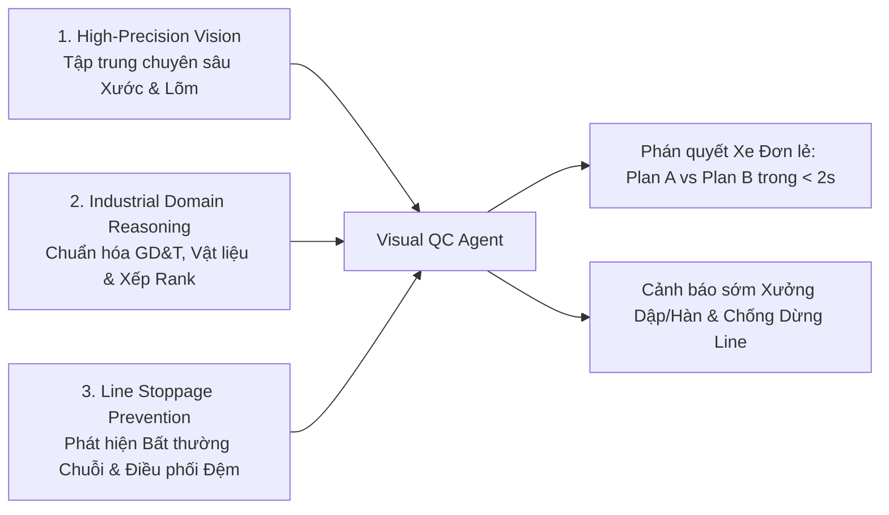
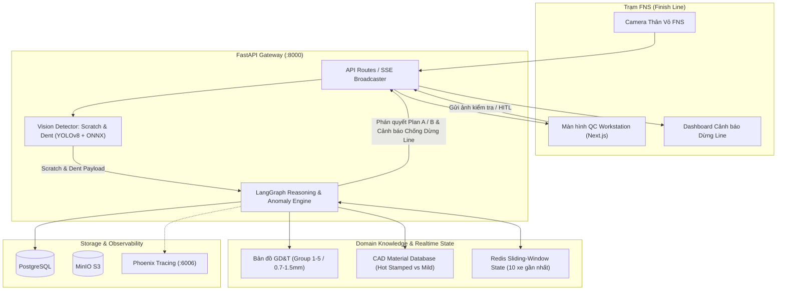

# 🚗 Visual QC Agent — Team 235
> **Hệ thống AI Agent Kiểm định Ngoại quan Thông minh & Cảnh báo Bất thường Chống Dừng Dây Chuyền tại Trạm FNS (Finish Line) — Line HA**  
> Dự án tham dự **VinUni AI20K Build Phase — Cohort 3**

[](https://fastapi.tiangolo.com)
[](https://langchain-ai.github.io/langgraph/)
[](https://ultralytics.com)
[](https://phoenix.arize.com)
[](https://www.docker.com)

---

## 🎯 1. Bối cảnh & Vấn đề Thực tế (Problem Statement)

Tại trạm **FNS (Finish Line - Trạm Hoàn thiện Cuối Dây chuyền Lắp ráp Ô tô)**:
- Chu kỳ kiểm tra (Takt Time) nghiêm ngặt từ **90 – 120 giây/xe**.
- **Hai loại lỗi ngoại quan phổ biến & tốn kém nhất:** **Vết Xước (Scratch)** và **Vết Lõm / Móp (Dent)**.
- **Hạn chế của giải pháp truyền thống:** 
  - Mô hình Computer Vision thông thường chỉ phát hiện bounding box, kiểm định viên QC vẫn mất **3 – 5 phút** lật tài liệu để đắn đo: *Lỗi này thuộc Rank nào? Vùng này là thép thường hay thép dập nóng (Hot Stamped Steel)? Dung sai GD&T cho phép bao nhiêu (Group 1–5: $0.7\text{mm} - 1.5\text{mm}$)? Nên cho xe chạy thử hay giữ lại?*
  - **Nỗi sợ lớn nhất của nhà máy ô tô — DỪNG LINE (Line Stoppage):** Khi một lỗi móp/xước lặp lại liên tiếp trên nhiều xe (do khuôn dập xưởng dập dính bavia hoặc tay gắp robot kẹp sai lực), việc phát hiện muộn gây dồn ứ xe tại trạm FNS và buộc nhà máy phải **DỪNG DÂY CHUYỀN KHẨN CẤP** — gây tổn thất hàng chục nghìn USD mỗi giờ.

---

## 💡 2. Giải pháp & Giá trị Đột phá của AI Agent

**Visual QC Agent** được thiết kế với 3 trụ cột giá trị cốt lõi:



1. **Thị giác Máy tính Tập trung (Focused High-Precision CV):** Nhận dạng siêu chính xác 2 lớp lỗi `scratch` và `dent`, đo đạc ước tính độ sâu móp (`estimated_depth_mm`) và vị trí vùng thân vỏ (`zone_name`), giảm thiểu $100\%$ báo động giả.
2. **Lập luận Chuẩn Công nghiệp (Industrial Reasoning Engine):** Tự động đối chiếu tọa độ lỗi với **Bản đồ GD&T (Group 1–5, Dung sai $0.7\text{mm} - 1.5\text{mm}$)**, loại vật liệu (**Thép dập nóng vs Thép thường**) và thang xếp rank **PSLAWBCD**.
3. **Phân luồng Tức thì (Actionable Routing < 2s):**
   - 🟢 **Phương án A (Buffing & Test Drive):** Lỗi nhẹ Rank C/D (xước bóng, móp nông vùng Group 2–4) $\rightarrow$ Đánh bóng nhanh 3 phút tại trạm $\rightarrow$ **XUẤT XANH CHO CHẠY THỬ**.
   - 🔴 **Phương án B (HOLD & Rework Shop):** Lỗi nặng Rank A/B, móp $>0.7\text{mm}$ (Group 1), hoặc chi tiết thép dập nóng $\rightarrow$ **GẮN NHÃN HOLD $\rightarrow$ CẤM CHẠY THỬ (Tránh bám bụi bẩn vào vết hở) $\rightarrow$ Chuyển thẳng xưởng Rework**.
4. **Hệ thống Phát hiện Bất thường Chuỗi & Chống Dừng Line (Systemic Anomaly & Line Stoppage Prevention):**
   - Giám sát Sliding Window $N = 10$ xe liên tiếp.
   - Khi phát hiện $\ge 3$ xe liên tiếp cùng bị lỗi tại 1 vị trí $\rightarrow$ Lập tức phát **Cảnh báo Sớm Nguyên nhân Gốc rễ** tới Xưởng Dập/Hàn thượng nguồn và kích hoạt **Điều phối Làn Đệm (Offline Buffer Routing)** giúp dây chuyền chính **TIẾP TỤC VẬN HÀNH BÌNH THƯỜNG, KHÔNG BỊ DỪNG LINE**.

---

## 📊 3. Ma trận Quyết định & Phân luồng (Decision Matrix)

| Loại Khuyết tật | Vị trí / Vùng GD&T | Vật liệu Thân vỏ | Severity Rank | Phán quyết Agent | Hành động Thực thi |
| :--- | :--- | :--- | :--- | :--- | :--- |
| **Xước nông / Xước dăm (Scratch)** | Cánh cửa / Cột (Group 2–4) | Thép mạ kẽm thường | **Rank C / D** | **PLAN A** | Đánh bóng 3 phút $\rightarrow$ **Cho phép chạy thử** |
| **Vết móp nông ($\le 0.7\text{mm}$)** | Mui xe / Tai xe (Group 2–3) | Thép thường | **Rank C** | **PLAN A** | Xử lý nhanh tại trạm $\rightarrow$ **Cho phép chạy thử** |
| **Vết móp sâu ($> 0.7\text{mm}$)** | Cánh cửa Class A (Group 1) | Thép thường | **Rank A / B** | **PLAN B** | **GẮN NHÃN HOLD $\rightarrow$ CẤM CHẠY THỬ $\rightarrow$ Rework** |
| **Vết móp biến dạng** | Khung cửa Class A (Group 1) | **Thép dập nóng (Hot Stamped)** | **Rank A** | **PLAN B** | **GẮN NHÃN HOLD $\rightarrow$ CẤM CHẠY THỬ**, Rework chuyên dụng |
| **Xước sâu chạm kim loại** | Nắp capo Class A (Group 1) | Mọi vật liệu | **Rank A / B** | **PLAN B** | **GẮN NHÃN HOLD $\rightarrow$ CẤM CHẠY THỬ $\rightarrow$ Xưởng Sơn** |

---

## 🏗️ 4. Kiến trúc Hệ thống (Architecture)



Tài liệu chi tiết:
- 📖 [PRD v1.1 Document](docs/PRD.md)
- 📐 [Architecture Document](ARCHITECTURE.md)
- 🔌 [API Contract & Schema](docs/API_CONTRACT.md)
- 📊 [Architecture Diagrams](docs/architecture_diagram.md)

---

## 👥 5. Đội ngũ Phát triển (Team 235)

| Họ và tên | Vai trò | Trách nhiệm chính |
| :--- | :--- | :--- |
| **Phạm Bá Huy** | **PM (Project Manager & Deploy)** | Điều phối dự án, PRD, quản trị tiến độ, chuẩn bị Demo Day & Pitch Deck. Xây dựng báo cáo và triển khai sản phẩm. |
| **Đào Hải Đăng** | **PO (Product Owner & Computer Vision)** | Thiết kế luồng User Journey, Wireframe trạm QC, chuẩn hóa quy chuẩn công nghiệp. Xây dựng và tối ưu mô hình CV cho sản phẩm. |
| **Lê Quốc An** | **DEV (Backend, Frontend & Agent)** | Phát triển FastAPI backend, xây dựng LangGraph State Machine, tích hợp Phoenix.  |
| **Hoàng Văn Thành** | **DEV (Benchmark & Test Engineer)** | Nghiên cứu tạo bộ Benchmark, đánh giá, thử nghiệm sản phẩm |

---

## ⚡ 6. Hướng dẫn Cài đặt & Chạy Thử (Quick Start)

### Yêu cầu Môi trường
- Python 3.11+
- Node.js 18+
- Docker & Docker Compose

```bash
# 1. Tạo môi trường ảo
python -m venv .venv
# Windows:
.venv\Scripts\activate
# Linux/macOS:
# source .venv/bin/activate

# 2. Cài đặt thư viện
pip install -e ".[dev]"

# 3. Cấu hình biến môi trường
cp .env.example .env

# 4. Cài đặt Hooks AI Logging
powershell -ExecutionPolicy Bypass -File scripts\setup_hooks.ps1

# 5. Chạy FastAPI backend
uvicorn src.main:app --reload --port 8000
# Swagger API Docs: http://localhost:8000/docs
```
