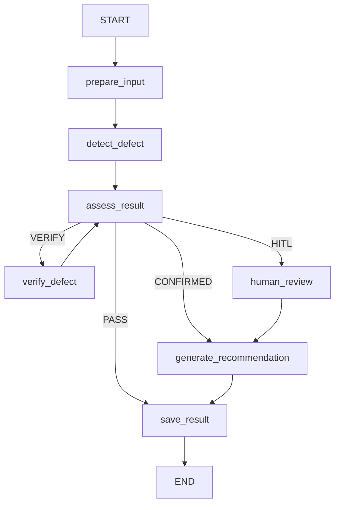

# Visual QC Agent — FNS Baseline MVP

Visual QC Agent là hệ thống pilot kiểm tra chất lượng bề mặt thân vỏ xe tại trạm
FNS. Phiên bản hiện tại tập trung vào một baseline có thể chạy end-to-end:

```text
Ảnh upload → best.pt segmentation → LangGraph → verify/HITL → SQLite → UI
```

Backend dùng FastAPI, Agent được điều phối bằng LangGraph, dữ liệu kết quả được
lưu trong SQLite và frontend là dashboard Next.js/React song ngữ Việt–Anh.

> Đây là bản pilot kỹ thuật. Kết quả CV đến từ `best.pt`; policy xử lý vẫn chưa
> phải tiêu chuẩn được nhà máy phê duyệt và không được dùng để tự động release xe
> sản xuất.

## 1. Trạng thái hiện tại

Baseline MVP đã có:

- Model segmentation `data/best.pt` chạy inference thật với 6 class: crack, dent,
  glass shatter, lamp broken, scratch và tire flat.
- Giao diện chạy upload-only: QC tải JPEG/PNG, backend chạy model và hiển thị kết quả.
- Agent theo dõi lỗi lặp theo loại lỗi + panel + camera; từ 3 xe trong 24 giờ sẽ
  cảnh báo QC kiểm tra công đoạn phía trước, từ 5 xe là mức nghiêm trọng.
- Màn hình `Cảnh báo lặp lỗi` cho phép tải báo cáo Word gồm evidence, danh sách
  xe liên quan và checklist xác minh khâu trước.
- LangGraph chạy thật với state, conditional routing, verify loop và HITL.
- Giao diện phát lại execution trace theo đúng thứ tự node sau khi model hoàn tất.
- Rule-based policy tạo phương pháp xử lý cụ thể và lý do có thể audit.
- SQLite lưu state cuối của LangGraph theo mỗi xe/thread.
- Giao diện Việt–Anh để upload evidence, theo dõi node, xử lý HITL và xem lịch sử.
- API xóa lịch sử Agent nhưng không xóa evidence đã upload.

Chưa có trong baseline:

- LLM hoặc Gemini/OpenAI API.
- GD&T, work instruction và policy production đã được nhà máy phê duyệt.
- PostgreSQL checkpointer, MinIO/S3 và Phoenix monitoring.

## 2. Model pilot hoạt động như thế nào?

Frontend chỉ gửi ảnh, Vehicle ID, camera và panel. Backend lưu evidence tại
`data/uploads`, chạy `best.pt`, chuẩn hóa boxes/masks của Ultralytics vào `QCState`,
sau đó LangGraph điều phối verify, HITL và recommendation. Trong pilot,
`AUTO_PASS_ENABLED=false`: model không phát hiện lỗi vẫn phải chuyển QC để tránh
false-negative dẫn đến tự động release.

## 3. Kiến trúc

```text
frontend/
  Next.js/React workstation
       │ multipart upload + HTTP
       ▼
backend/
  FastAPI routes + validation
       │
       ▼
agent/
  LangGraph state machine
  ├── DetectorService  → LocalYoloSegmentationDetector(best.pt)
  ├── VerifierService  → model second pass
  ├── ReasoningService → deterministic formatter, không gọi LLM
  └── QCRepository     → SQLite hiện tại / PostgreSQL tương lai
       │
       ▼
data/visual_qc.db
```

## 4. LangGraph workflow



Mermaid sinh từ graph thật có thể lấy qua `GET /agent/graph` hoặc export bằng:

```powershell
python -m scripts.export_agent_graph
```

Kết quả được lưu tại `agent_flow.mmd`; bản giải thích trực quan nằm trong
`AGENT_FLOW.md`.

### QCState

`agent/graph/state.py` định nghĩa state dùng chung giữa các node. State chứa:

- `inspection_id`, `thread_id`, `vehicle_id`;
- `image_url`, `image_paths`, `camera_id`, `panel`;
- `defect_detected`, `defect_type`, `confidence`, bbox/segmentation;
- `severity`, `decision`, `reason`, `assessment_route`;
- `verify_count`, `verify_result`, retry/error metadata;
- `human_required`, `human_decision`;
- `recommendation_code`, `recommendation`, `final_status`;
- `execution_trace` để UI hiển thị từng node.

### Trách nhiệm của node

| Node                      | Vai trò                                                |
| ------------------------- | ------------------------------------------------------ |
| `prepare_input`           | Kiểm tra ảnh đầu vào và khởi tạo metadata an toàn      |
| `detect_defect`           | Gọi detector adapter và chuẩn hóa kết quả CV           |
| `assess_result`           | Áp threshold để chọn PASS, CONFIRMED, VERIFY hoặc HITL |
| `verify_defect`           | Thực hiện second pass và quay lại assessment           |
| `human_review`            | Dừng graph bằng `interrupt()` để QC quyết định         |
| `generate_recommendation` | Chọn phương pháp kiểm soát theo policy deterministic   |
| `save_result`             | Lưu state cuối qua repository                          |

### Conditional routing và loop guard

Rule baseline:

1. Không phát hiện lỗi → `PASS` → lưu kết quả.
2. Verify đã xác nhận → `CONFIRMED` → sinh recommendation.
3. Verify vẫn không rõ và `verify_count >= 2` → `HITL`.
4. Confidence `>= 0.85` → xác nhận tự động.
5. Confidence từ `0.50` đến dưới `0.85` → verify.
6. Confidence dưới `0.50` → HITL fail-safe.

Guard `verify_count >= 2` ngăn loop vô hạn.

### HITL pause/resume

`human_review` dùng `interrupt()` thật của LangGraph. Checkpoint được lưu theo
`thread_id`; khi QC xác nhận, API resume cùng thread bằng `Command(resume=...)`.

```python
from langgraph.types import Command

graph.invoke(
    Command(resume={
        "action": "APPROVE",
        "reviewer": "qc-inspector-01",
        "reason": "Confirmed under controlled lighting.",
    }),
    config={"configurable": {"thread_id": thread_id}},
)
```

Development dùng `InMemorySaver`. Kết quả cuối được lưu thêm vào SQLite. Khi
chuyển sang PostgreSQL, có thể inject `PostgresSaver` vào graph builder mà không
cần thay đổi node.

## 5. Database SQLite

Database mặc định: `data/visual_qc.db`.

| Table              | Nội dung                                             |
| ------------------ | ---------------------------------------------------- |
| `agent_graph_runs` | State cuối của LangGraph theo `thread_id`            |

`InMemorySaver` giữ checkpoint đang chạy hoặc đang chờ HITL. SQLite giữ kết quả
cuối để History và QC Queue vẫn đọc được sau khi backend restart.

## 6. API chính

Swagger: `http://127.0.0.1:8000/docs`

### LangGraph API

| Method | Endpoint                          | Mục đích                                  |
| ------ | --------------------------------- | ----------------------------------------- |
| POST   | `/inspections`                    | Bắt đầu graph thread                      |
| POST   | `/inspections/stream`             | Chạy inspection và stream từng node       |
| POST   | `/inspections/from-image`          | Upload JPEG/PNG, chạy best.pt và LangGraph |
| GET    | `/api/quality-alerts`              | Phân tích xu hướng lỗi lặp từ SQLite audit |
| GET    | `/api/quality-alerts/report.docx`  | Tải báo cáo cảnh báo và kế hoạch kiểm tra |
| GET    | `/inspections/{thread_id}/state`  | Đọc checkpoint/state hiện tại             |
| POST   | `/inspections/{thread_id}/resume` | Resume HITL                               |
| GET    | `/agent/runs`                     | Danh sách graph run đã lưu                |
| DELETE | `/agent/runs`                     | Xóa trace/history, giữ nguyên ảnh upload  |
| GET    | `/agent/graph`                    | Trả Mermaid từ graph thật                 |

Các alias `/api/langgraph/...` và `/api/agent/...` cũng được hỗ trợ.

## 7. Yêu cầu môi trường

- Git.
- Python 3.11 trở lên; khuyến nghị Python 3.11.
- Node.js 22.13 trở lên.
- npm đi kèm Node.js.
- Docker Desktop chỉ cần khi muốn chạy backend bằng container.

Kiểm tra phiên bản:

```powershell
python --version
node --version
npm --version
```

## 8. Cài đặt trên máy mới — Windows PowerShell

Clone repository và mở PowerShell tại thư mục gốc:

```powershell
git clone <repository-url>
cd P-235
Copy-Item .env.example .env
python -m venv .venv
Set-ExecutionPolicy -Scope Process -ExecutionPolicy Bypass
.\.venv\Scripts\Activate.ps1
python -m pip install --upgrade pip
python -m pip install -r requirements.txt
```

Chạy backend:

```powershell
python -m uvicorn backend.app.main:app --reload
```

Mở PowerShell thứ hai và chạy frontend:

```powershell
cd frontend
Copy-Item .env.example .env.local
npm ci
npm run dev
```

Mở `http://localhost:3000`; API mặc định tại `http://127.0.0.1:8000`.

### Linux/macOS

```bash
cp .env.example .env
python3 -m venv .venv
source .venv/bin/activate
python -m pip install --upgrade pip
python -m pip install -r requirements.txt
python -m uvicorn backend.app.main:app --reload
```

Trong terminal thứ hai:

```bash
cd frontend
cp .env.example .env.local
npm ci
npm run dev
```

## 9. Cấu hình môi trường

Root `.env`:

```dotenv
DATABASE_URL=sqlite:///./data/visual_qc.db
DETECTOR_PROVIDER=local_yolo
MODEL_PATH=./data/best.pt
MODEL_DEVICE=cpu
MODEL_CONFIDENCE=0.25
MODEL_IMAGE_SIZE=1280
AUTO_PASS_ENABLED=false
CONFIRMED_THRESHOLD=0.70
VERIFY_THRESHOLD=0.40
ENABLE_LANGSMITH_TRACING=false
LANGSMITH_TRACING=false
LANGCHAIN_TRACING_V2=false
```

`frontend/.env.local`:

```dotenv
NEXT_PUBLIC_API_BASE_URL=http://127.0.0.1:8000
```

## 10. Chuẩn bị và chạy demo

Kịch bản demo đề xuất:

1. Mở **Kiểm tra bằng Agent** và tải một ảnh JPEG/PNG từ máy.
2. Điền Vehicle ID, Camera ID, panel và nhấn **Bắt đầu kiểm tra bằng Agent**.
3. Theo dõi `prepare_input → detect_defect → assess_result` xuất hiện từng bước.
4. Kiểm tra class, confidence, bbox, segmentation mask, model version và inference time.
5. Kết quả confidence trung bình sẽ chạy model second pass.
6. Không detection hoặc confidence thấp sẽ dừng tại HITL để QC approve/reject.
7. Mở **Lịch sử** để xem state đã lưu hoặc xóa trace cũ.
8. Mở `/agent/graph` để đối chiếu UI trace với LangGraph thật.

Trong Windows PowerShell, `curl` là alias của `Invoke-WebRequest`; nên dùng
`Invoke-RestMethod` hoặc gọi rõ `curl.exe`.

## 11. Kiểm thử

Backend, từ thư mục gốc và sau khi activate virtual environment:

```powershell
python -m pytest -q
python -m ruff check backend agent tests
```

Frontend:

```powershell
cd frontend
npm test
```

`npm test` thực hiện production build trước khi chạy test giao diện.

## 12. Chạy backend bằng Docker

```powershell
Copy-Item .env.example .env
docker compose up --build
```

Container phục vụ backend tại `http://127.0.0.1:8000`. Frontend vẫn chạy riêng
bằng `npm run dev`.

## 13. Mở rộng thành phần production

### YOLO/segmentation

`LocalYoloSegmentationDetector` hiện chạy `best.pt`. Khi model của team sẵn sàng,
thay đường dẫn `MODEL_PATH`; giữ nguyên contract `defect_detected`, `defect_type`,
confidence, bbox và segmentation result trong `QCState`.

### Verifier

`ModelVerifier` hiện chạy second pass bằng cùng model. Production có thể chuyển
sang crop độ phân giải cao, camera thứ hai hoặc model ensemble đã được phê duyệt,
nhưng phải giữ contract `verify_count/verify_result`.

### PostgreSQL checkpoint/database

Cài `langgraph-checkpoint-postgres`, khởi tạo `PostgresSaver`, chạy `setup()` một
lần và truyền checkpointer vào graph builder. Repository có thể implement lại
`QCRepository` cho PostgreSQL mà không sửa graph node.

### LLM reasoning

Baseline không cần LLM. Nếu sau này cần giải thích phức tạp, implement một
`ReasoningService` riêng và chỉ dùng cho phần diễn giải. Không giao quyền release,
safety routing hoặc tạo tự do phương pháp sửa chữa cho LLM.

## 14. Cấu trúc repository

```text
agent/                 QCState, LangGraph nodes/routes/builder và service adapters
backend/               FastAPI, SQLite repository, quality alerts và API
frontend/              Next.js/React dashboard song ngữ
data/uploads/          evidence do QC tải lên (không commit)
data/best.pt           model segmentation local (không commit)
docs/                  tài liệu kỹ thuật bổ sung
scripts/               công cụ export graph
tests/                 backend và LangGraph tests
AGENT_FLOW.md           sơ đồ và giải thích workflow
agent_flow.mmd          Mermaid sinh từ graph
requirements.txt        dependency Python runtime + test
docker-compose.yml      chạy backend bằng Docker
```

## 15. Troubleshooting

- `spawn EINVAL`: dùng Node.js 22.13+ và mở lại PowerShell.
- Virtual environment trỏ đến Python đã bị gỡ: xóa riêng `.venv`/`.venv-new`, tạo
  lại bằng `python -m venv .venv`, rồi cài `requirements.txt`.
- Port 8000 đang bận: chạy Uvicorn với `--port 8001` và đổi
  `NEXT_PUBLIC_API_BASE_URL` thành `http://127.0.0.1:8001`.
- UI không kết nối backend: kiểm tra `/health`, CORS và giá trị
  `NEXT_PUBLIC_API_BASE_URL`.
- Lịch sử bị cộng dồn: dùng nút xóa lịch sử hoặc gọi `DELETE /agent/runs`.
- LangSmith trả về `403 Forbidden`: giữ `ENABLE_LANGSMITH_TRACING=false` khi chạy local.
  Chỉ bật lại sau khi cấu hình `LANGSMITH_API_KEY` và `LANGSMITH_PROJECT` hợp lệ.
