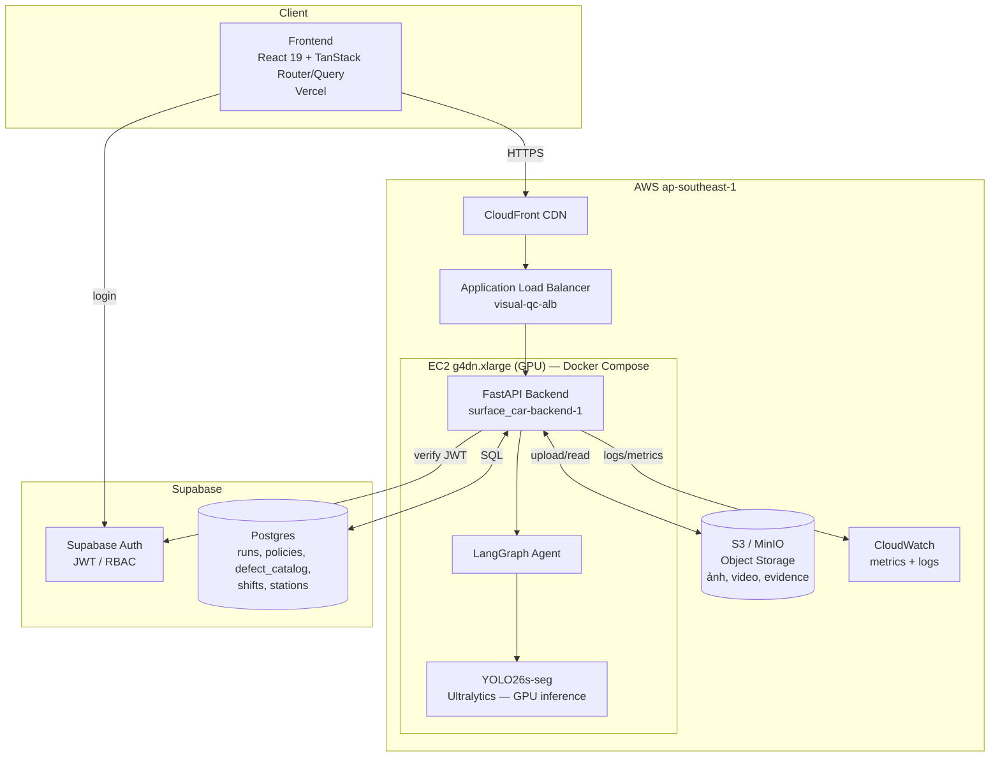
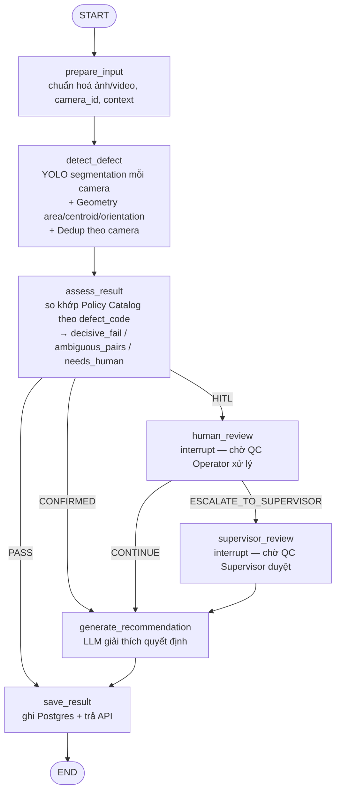
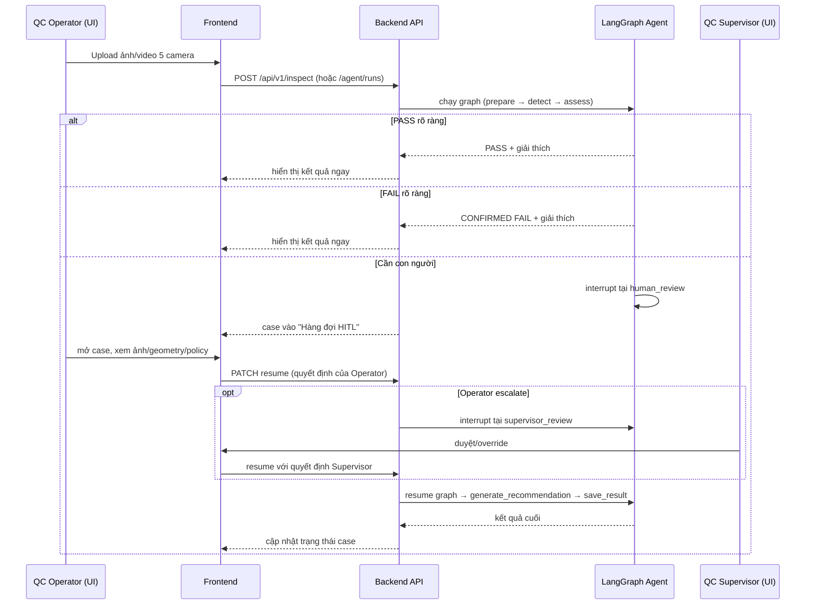

# Kiến trúc hệ thống — Visual QC Agent

## 1. Sơ đồ tổng thể (infra + luồng request)

**Vai trò từng phần:**

| Thành phần | Nhiệm vụ |
| --- | --- |
| **Frontend (Vercel)** | UI cho QC Operator/Supervisor: upload ảnh/video, xem kết quả, xử lý hàng đợi HITL, dashboard trend. Gọi API qua CloudFront. |
| **CloudFront** | CDN đứng trước ALB — cache static, TLS, một domain public duy nhất. |
| **ALB (`visual-qc-alb`)** | Load balancer, health-check `/health`, phân phối traffic tới EC2 backend. |
| **EC2 GPU (`g4dn.xlarge`)** | Host duy nhất chạy container backend bằng Docker Compose, có GPU Tesla T4 pass-through cho YOLO. |
| **FastAPI Backend** | API layer: auth, REST endpoints (`/api/v1`, `/agent/*`), điều phối gọi LangGraph Agent, đọc/ghi Postgres và S3. |
| **YOLO26s-seg** | Model detection/segmentation (Scratch, Dent) chạy trên GPU, output bbox/mask/confidence. |
| **LangGraph Agent** | State machine điều phối toàn bộ pipeline nghiệp vụ (chi tiết ở mục 2). |
| **S3 / MinIO** | Lưu ảnh gốc, video, crop ảnh lỗi, overlay — fallback về local disk nếu chưa cấu hình S3. |
| **Supabase Auth** | Xác thực người dùng (JWT), cấp role `QC_OPERATOR`/`QC_SUPERVISOR`. |
| **Supabase Postgres** | Nguồn sự thật duy nhất: agent run state, policy catalog, defect catalog, shift/station, quality alerts. |
| **CloudWatch** | Log container (awslogs driver) + custom metric CPU/RAM/GPU/disk + ALB latency/error dashboard. |

---

## 2. Luồng LangGraph Agent (state machine xử lý 1 lần kiểm tra)

**Vai trò từng node:**

| Node | Nhiệm vụ |
| --- | --- |
| `prepare_input` | Chuẩn hoá input (ảnh/video → frame), gắn `camera_id`, ngữ cảnh xe/lô/ca. |
| `detect_defect` | Chạy YOLO trên từng camera, trích geometry, dedup phát hiện trùng lặp trong cùng video (union-find spatial/temporal merge). |
| `assess_result` | Đối chiếu từng lỗi với Policy Catalog theo `defect_code`; phân loại `decisive_fail` (rõ ràng FAIL), `ambiguous_pairs` (cần LLM), `needs_human` (policy bắt buộc HITL). |
| `human_review` | Node **interrupt** — dừng graph, chờ QC Operator xem và quyết định trên UI (hàng đợi HITL). |
| `supervisor_review` | Node **interrupt** thứ hai — chỉ vào khi Operator escalate; chờ QC Supervisor duyệt/override. |
| `generate_recommendation` | Gọi LLM (Groq) sinh giải thích bằng ngôn ngữ tự nhiên cho quyết định đã chốt. |
| `save_result` | Ghi toàn bộ state (detections, decision, evidence) vào Postgres, trả kết quả cho API/UI. |

---

## 3. Luồng nghiệp vụ end-to-end (người dùng thấy gì)

---

## 4. Ghi chú

- Toàn bộ business logic điều phối (policy match, routing PASS/FAIL/HITL) nằm **trong LangGraph Agent**, không phải microservice riêng — xem `PRD.md` §2, §7.
- Sơ đồ trên phản ánh code hiện tại (`agent/graph/builder.py`, `docker-compose.yml`, `backend/app/auth.py`, `agent/services/object_storage.py`) tại thời điểm viết tài liệu — cập nhật lại nếu graph hoặc hạ tầng thay đổi.
