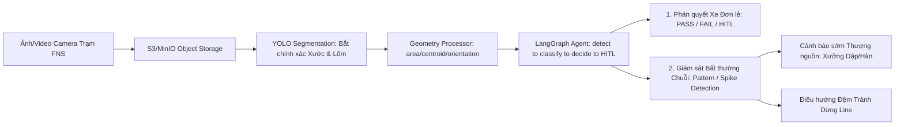

# Product Requirement Document (PRD)
# Visual QC Agent — Automotive Quality Control & Intelligent Routing System (FNS Line)

- **Mã dự án:** P-235 (Team 235)
- **Tên sản phẩm:** Visual QC Agent (Hệ thống Kiểm định Ngoại quan Thông minh & Điều hướng Xe)
- **Trọng tâm kỹ thuật:** Nhận dạng chuyên sâu khuyết tật **Xước (Scratch)** & **Lõm/Móp (Dent)** bằng **YOLO Segmentation**, trích xuất hình học deterministic (**Geometry Extraction**), giải thích quyết định bằng **reasoning LLM**, điều phối quyết định bằng **LangGraph Agent** (`detect → classify → decide → HITL`), và **Phát hiện Bất thường Chuỗi tránh Dừng Dây chuyền (Line Stoppage Prevention)**.
- **Vị trí áp dụng:** Trạm FNS (Finish Line - Trạm Hoàn thiện Cuối Dây chuyền Lắp ráp Ô tô) — Line HA
- **Tác giả:** PM & PO Team 235
- **Phiên bản:** v1.5 (Đồng bộ tài liệu với runtime: bước **classify** — chọn mã lỗi/severity
  band cho từng detection — chạy bằng **rule engine deterministic**
  (`agent/services/defect_rule_engine.py`), KHÔNG dùng LLM; LLM (`GroqReasoningService`)
  chỉ còn đúng vai trò FR-03d/FR-07 (giải trình sau quyết định), khớp đúng tuyên bố ở §7.3
  rằng LLM "không được tự thay đổi PASS/FAIL" — trước bản này, code có lệch khỏi tuyên bố
  đó (LLM từng được dùng để chọn mã lỗi, một phần của bước "decide"); xem
  `ISSUE_REMEDIATION_PLAN.md` mục 1. Cũng thêm hỗ trợ resume HITL cho nhiều finding độc
  lập trong cùng một ca (`detection_resolutions`, xem `API_CONTRACT.md`).)
- **Phiên bản trước:** v1.4 (Đồng bộ tài liệu với runtime hiện tại: xác nhận bỏ hẳn Visual Verification bằng Multimodal LLM khỏi §7.3/§7.4/§7.6; rút gọn `final_status` còn đúng hai giá trị `PASS`/`FAIL` — không còn `HOLD_FOR_QC`/`HOLD_FOR_REWORK`/trạng thái tái kiểm tra riêng, mọi FAIL đều chuyển Rework; mô tả HITL hai cấp Inspector→Supervisor đang chạy thật trong `agent/graph/nodes.py`)

---

## 1. Bối cảnh & Tuyên ngôn Bài toán (Problem Statement)

### 1.1. Bối cảnh Sản xuất Ô tô tại Trạm FNS Line
Trạm **FNS (Finish Line)** là chốt chặn chất lượng hoàn thiện trước khi xe ra sân thử nghiệm (Test Drive Track) hoặc xuất xưởng. Chu kỳ kiểm tra (Takt Time) tại trạm cực kỳ nghiêm ngặt: **90 – 120 giây/xe**.

Hai loại khuyết tật ngoại quan phổ biến và gây thiệt hại kinh tế nặng nề nhất là:
1. **Vết Lõm / Móp (Dent):** Biến dạng cơ học do va quẹt, khuôn dập lỗi hoặc robot kẹp sai lực.
2. **Vết Xước (Scratch):** Tổn thương lớp sơn bóng (Clear-coat), sơn lót (Primer) hoặc chạm lớp tôn kim loại.

### 1.2. Nỗi đau (Painpoints) Thực tế
1. **Khó khăn trong đánh giá thủ công:** QC mất 3–5 phút đắn đo xem vết lõm/xước có vượt dung sai tham chiếu (tolerance demo hiện tại là `DEMO_BASELINE_ONLY`, xem mục 5.1) không, có được phép buffing không hay phải giữ xe lại.
2. **Rủi ro bẩn vết lỗi khi chạy thử:** Nếu xe bị móp/xước sâu mà vẫn ra sân chạy thử, bụi đất và nước bắn vào vết hở làm hư hại lớp sơn lót, chi phí Rework sau đó tăng gấp 5–10 lần.
3. **Nỗi sợ lớn nhất của nhà máy: DỪNG LINE (Line Stoppage):**
   - Khi một lỗi lõm/xước xuất hiện lặp lại liên tiếp trên nhiều xe (ví dụ: 3–5 xe liên tiếp cùng bị móp ở góc mép cánh cửa trước trái do cối dập dính mạt kim loại ở xưởng Dập/Hàn), việc phát hiện muộn sẽ dẫn đến:
     - Hàng loạt xe bị tắc nghẽn tại trạm FNS Line.
     - Nhà máy buộc phải **DỪNG DÂY CHUYỀN KHẨN CẤP** để tìm nguyên nhân (chi phí dừng chuyền ô tô lên tới hàng chục nghìn USD mỗi giờ).

---

## 2. Kiến trúc Tổng thể Hệ thống (System Architecture)

> **Visual QC Agent là toàn bộ workflow end-to-end dưới đây, không phải riêng một LLM.** Việc phát hiện lỗi (YOLO), đo hình học (Geometry Processor) và quyết định PASS/FAIL cuối cùng (LangGraph + QC Rules) đều là các thành phần deterministic hoặc controlled riêng biệt; một reasoning LLM chỉ giải thích kết quả sau khi đã có quyết định.

```text
Camera / Image / Video Upload
        ↓
FastAPI Backend
        ↓
Image bytes ──────────────┬─────────────────────────→ S3 / MinIO Object Storage
        ↓                 │                            (evidence persistence:
LangGraph Agent           │                             original/overlay/crop/mask)
detect → extract_geometry │
  → classify → decide     │
        ↓                 │
QC Rules (decision_gate)  │
   ├─ đủ evidence ────────┼──→ final_decide
   └─ mơ hồ/nghiêm trọng ─┼──→ HITL → human review → [supervisor review] → resume → final_decide
        ↓                 │
Reasoning LLM Explanation (chỉ sau final_decide)
        ↓                 │
PASS / FAIL (final_status — mục 5.3, API_CONTRACT.md §3)
        ↓                 ↓
PostgreSQL / Supabase (metadata, decision, object key)
        ↓
Trend / Anomaly Analysis
        ↓
Dashboard / History / Alerts
```

`S3/MinIO` là **persistence branch song song** — backend không bắt buộc phải
tải ảnh ngược lại từ object storage rồi mới chạy YOLO khi đã có sẵn image
bytes trong request; xem mục 7.6 (FR-17) và `API_CONTRACT.md` §4.

Vai trò từng thành phần (chi tiết I/O ở mục 7 và `API_CONTRACT.md`):

| Thành phần | Trả lời câu hỏi | Nguồn dữ liệu (provenance) |
| :--- | :--- | :--- |
| **YOLO Segmentation** | Có lỗi gì và lỗi nằm ở đâu? | `source = yolo` |
| **Geometry Processor** | Mask có đặc trưng hình học deterministic nào? | `source = geometry_processor` |
| **QC Rules** | Theo controlled QC criteria hiện tại, evidence này phải xử lý thế nào? | `source = qc_policy` |
| **LangGraph Agent** | Workflow tiếp theo là PASS, FAIL hay HITL? | điều phối toàn bộ node trên |
| **Human-In-The-Loop** | Khi evidence chưa đủ hoặc model conflict, con người xác nhận thế nào? | `source = human_qc` |
| **S3 / MinIO** | Evidence ảnh/mask/crop lưu ở đâu? | object storage |
| **PostgreSQL / Supabase** | Inspection metadata, decision, history, lot/shift, alert lưu ở đâu? | relational database |

`QC Rules`, việc điều phối node và quyết định cuối cùng đều là công cụ/node **thuộc LangGraph Agent**, không phải các microservice độc lập (`Policy Engine`, `Decision Engine`, `Reasoning Engine`) trong MVP này — xem thêm mục 7.3 và `POLICY_GOVERNANCE.md`.

---

## 3. Định vị Sản phẩm & Giá trị Đột phá (Core Value Proposition)

> **Visual QC Agent = YOLO Segmentation (Scratch & Dent) + Geometry Extraction + LangGraph QC Rules Reasoning + Hệ thống Cảnh báo Bất thường Chuỗi Tránh Dừng Line (Systemic Anomaly & Line Stoppage Prevention)**



---

## 4. Chân dung Người dùng (User Personas & Roles)

MVP có hai vai trò đăng nhập (RBAC), ánh xạ trực tiếp tới hai persona vận hành chính (chi tiết quyền hạn ở mục 7.6 và `POLICY_GOVERNANCE.md`):

1. **QC Inspector (Kiểm định viên FNS) — role `QC_OPERATOR`:** Thao tác trực tiếp tại trạm, upload ảnh/video, xem segmentation/geometry/visual assessment, cần chỉ dẫn điều hướng tức thì trong 2s (**PASS: Đánh bóng 3m nếu cần** hay **FAIL/HOLD: Giữ xe**), xử lý HITL khi được phân công.
2. **Line Supervisor / Trưởng ca Sản xuất — role `QC_SUPERVISOR`:** Có toàn bộ quyền Operator, thêm quyền xem dashboard toàn ca/lô, anomaly alert, historical trend, và approve override khi phù hợp scope dự án.
3. **Rework Technician (Kỹ thuật viên Sửa chữa):** Persona downstream tiếp nhận xe FAIL/HOLD kèm hồ sơ lỗi chi tiết (tọa độ, geometry, ảnh evidence). Trong MVP hiện tại, đây là người tiêu thụ output (qua hồ sơ in/hand-off) chứ chưa có tài khoản đăng nhập riêng; RBAC cho vai trò này là **Future Extension**.

---

## 5. Ma trận Quyết định & Phân luồng Kỹ thuật (Decision Matrix)

### 5.1. Trạng thái Demo QC Policy (không phải OEM Production Standard)

Các giá trị tolerance dưới đây là **Demo QC Policy** phục vụ MVP và workflow validation. Chúng **không đại diện cho OEM production acceptance criteria** — public standards (ISO 4628-1, ISO 1101, ...) không công bố giới hạn chấp nhận cosmetic cụ thể theo OEM (xem `POLICY_GOVERNANCE.md`). Khi triển khai thực tế, các giá trị này phải được thay bằng approved plant cosmetic standard, control plan, engineering drawing hoặc controlled quality policy.

- **Nhóm dung sai demo (`DEMO_BASELINE_ONLY`):** Group 1 (Class A: $\le 0.7\text{mm}$), Group 2 (Tai xe/Mui: $\le 1.0\text{mm}$), Group 3 (Cột A/B/C: $\le 1.2\text{mm}$), Group 4-5 (Gầm/Sàn: $\le 1.5\text{mm}$).
- Trạng thái các giá trị này giữ nguyên `DEMO_BASELINE_ONLY` cho tới khi có controlled production source (xem checklist phê duyệt trong `POLICY_GOVERNANCE.md`).

### 5.2. Vật liệu Thân vỏ — loại khỏi input quyết định bắt buộc của MVP

Baseline MVP **không** dùng thuộc tính vật liệu (Mild Steel / Hot Stamped Boron Steel) làm input cho quyết định PASS/FAIL tự động, không cho Multimodal LLM đoán vật liệu từ ảnh, và `material` không thuộc `QCState`/API/UI (xem mục 8). Việc phân biệt vật liệu để chọn phương án nắn nguội/hạn chế thao tác là nội dung **material-aware reasoning — Future Extension** (mục 11), và trong triển khai production phải lấy từ nguồn authoritative (`vehicle_id → MES/BOM → panel/material mapping`), không suy đoán từ ảnh.

### 5.3. Ma trận Phân luồng Từng Xe (Individual Vehicle Routing)

| Loại Khuyết tật | Vị trí / Vùng GD&T (demo) | Severity Rank | Phán quyết Agent | Hành động Điều hướng Thực thi |
| :--- | :--- | :--- | :--- | :--- |
| **Xước nông / Xước dăm (Scratch)** | Cánh cửa / Cột (Group 2–4) | **Rank C / D** | **PASS** | Đánh bóng (Buffing) 3 phút tại trạm $\rightarrow$ **CHO PHÉP CHẠY THỬ** |
| **Vết móp nông ($\le 0.7\text{mm}$, demo tolerance)** | Mui xe / Tai xe (Group 2–3) | **Rank C** | **PASS** | Hút chân không/Xử lý nhanh $\rightarrow$ **CHO PHÉP CHẠY THỬ** |
| **Vết móp sâu ($> 0.7\text{mm}$, demo tolerance)** | Cánh cửa Class A (Group 1) | **Rank A / B** | **FAIL** | **CẤM CHẠY THỬ** (tránh bụi bẩn) $\rightarrow$ chuyển Rework |
| **Vết móp biến dạng, nghi vật liệu cứng** | Khung cửa Class A (Group 1) | **Rank A** | **FAIL** | **CẤM CHẠY THỬ**, chuyển Rework để QC/kỹ thuật xác minh vật liệu và phương án xử lý |
| **Xước sâu chạm kim loại** | Nắp capo Class A (Group 1) | **Rank A / B** | **FAIL** | **CẤM CHẠY THỬ**, chuyển xưởng Sơn |

Bất kỳ trường hợp nào thiếu evidence hình học/measurement bắt buộc, `LLM
provider unavailable/invalid`, hoặc Agent không phân loại được lỗi đều route
sang **HITL** trước khi có PASS/FAIL tự động — xem mục 7.6 và
`POLICY_GOVERNANCE.md`.

Cột "Phán quyết Agent" và giá trị `final_status` chuẩn trả về trong
`QCState`/API **là cùng một cặp giá trị**: `PASS` hoặc `FAIL`. Không còn phân
biệt `HOLD_FOR_REWORK` / `HOLD_FOR_QC` / trạng thái tái kiểm tra riêng —
**mọi trường hợp FAIL đều đi thẳng đến Rework**, không chia nhỏ theo lý do.
Khi QC Inspector xử lý HITL và bác bỏ (REJECT) lỗi mà AI gắn cờ (không phải
lỗi thật), xe được quyết định `PASS` ngay lập tức, không có bước "tái kiểm
tra" (reinspect) riêng biệt nào khác — xem mục 7.6, `API_CONTRACT.md` §4.

---

## 6. Tính năng Đột phá: Giám sát Bất thường Chuỗi & Chống Dừng Line (Systemic Anomaly & Line Stoppage Prevention)

### 6.1. Cơ chế Phát hiện Bất thường Lặp lại (Realtime Sliding Window Anomaly)
Hệ thống duy trì một **Sliding Window Buffer** (theo dõi $N = 10$ xe gần nhất qua trạm) phục vụ **cảnh báo sớm realtime**, tách biệt với phân tích lịch sử (mục 6.3):
- **Điều kiện kích hoạt Cảnh báo Bất thường (Anomaly Trigger):** Khi phát hiện $\ge 3$ xe liên tiếp (hoặc $\ge 4$ xe trong cửa sổ 10 xe) gặp cùng một loại lỗi (Dent hoặc Scratch) tại cùng một vùng tọa độ không gian (cùng GD&T Zone).
- **Root Cause Hypothesis (giả thuyết cần QC xác minh, không phải kết luận chắc chắn):**
  - Cụm vết móp cùng tọa độ $\rightarrow$ *Giả thuyết: Khuôn dập (Stamping Die) dính bavia/mạt kim loại hoặc tay gắp robot hàn bị kẹt dị vật.*
  - Cụm vết xước cùng đường kẻ dọc $\rightarrow$ *Giả thuyết: Con lăn băng tải hoặc thanh dẫn hướng bị cọ xát.*
  - **"Cùng tọa độ" là điều kiện kích hoạt, không phải diễn giải:** hệ thống chỉ được phát biểu
    một trong hai giả thuyết cụ thể trên khi **cả ba** tín hiệu độc lập sau đều đúng
    (`RepetitionAlertService._predicted_root_cause`, `backend/app/quality_alerts.py`) — thiếu
    một trong ba là chưa đủ căn cứ để nêu đích danh một cơ chế thiết bị:
    1. **`coordinate_cluster`** — các occurrence trong nhóm thực sự cụm lại gần cùng một tọa độ
       khung hình (đo bằng độ lệch chuẩn `center_x_ratio`/`center_y_ratio` của detection chính
       giữa các xe), không chỉ vì chúng cùng `defect_type` và cùng `zone_name` (`zone_name` chỉ
       là 5 vùng thân xe thô, một xe lỗi ở góc trái và một xe lỗi ở góc phải của cùng vùng đó vẫn
       được coi là "cùng zone" nhưng KHÔNG cùng tọa độ).
    2. **`single_camera`** — mọi occurrence trong nhóm đến từ cùng một camera. Một tuyên bố "cùng
       vị trí vật lý" trải trên nhiều camera khác nhau là bằng chứng yếu hơn, vì mỗi camera
       thường chỉ quan sát một phần cố định của xe — khớp tọa độ xuyên camera nhiều khả năng là
       trùng hợp hơn là cùng một nguyên nhân vật lý.
    3. **`severity_at_least_warning`** — nhóm đạt tối thiểu ngưỡng WARNING (mặc định ≥3 xe liên
       tiếp hoặc ≥4/10 xe trong cửa sổ), không dừng ở WATCH (có thể chỉ 2 xe) — một trùng hợp 2 xe
       là mẫu quá nhỏ để cử người đi kiểm tra đúng một thiết bị cụ thể.

    Thiếu bất kỳ tín hiệu nào trong ba tín hiệu trên, hệ thống trả về giả thuyết trung tính
    (`ZONE_ONLY_UNCONFIRMED`): liệt kê các khả năng cần xác minh thêm, không khẳng định một cơ
    chế thiết bị cụ thể — tránh đúng lỗi "kết luận chắc chắn giả danh giả thuyết" mà đề bài cấm.
    Trường `root_cause_evidence` (`COORDINATE_CLUSTER_CONFIRMED` | `ZONE_ONLY_UNCONFIRMED`) và
    `root_cause_evidence_detail` (chi tiết cả ba tín hiệu, để QC/báo cáo thấy rõ vì sao hệ thống
    kết luận vậy thay vì chỉ tin vào text tự do) trong response của `GET /api/quality-alerts` —
    xem `API_CONTRACT.md` §6.4.

### 6.2. Kế hoạch Hành động Điều hướng Chống Dừng Line (Line Stoppage Prevention Plan)

Trong baseline MVP, hệ thống **không tích hợp PLC/MES/băng tải thật** (chưa
có actuator điều khiển vật lý — xem mục 11 Future Extension). Vì vậy cả 3
hành động dưới đây là **đề xuất/tín hiệu cho con người quyết định**
(recommendation, hiển thị trên UI/SSE — `UI_WORKFLOWS.md` §4,
`API_CONTRACT.md` §7.2), không phải lệnh điều khiển tự động dây chuyền/robot
thật. Khi phát hiện bất thường chuỗi, Agent sinh 3 đề xuất phối hợp:

1. **Phát Tín hiệu Cảnh báo Sớm (Early Warning Broadcast):** Gửi cảnh báo tức thì kèm hình ảnh và tọa độ nghi ngờ lên màn hình Giám sát FNS và Xưởng Thượng nguồn (Xưởng Dập / Xưởng Hàn) để kiểm tra khuôn ngay trong chu kỳ Takt Time tiếp theo.
2. **Đề xuất Điều hướng Vùng Đệm (Buffer Area Routing Recommendation):** Đề xuất điều hướng các xe bị lỗi thuộc lô bất thường vào làn đệm (Offline Inspection Buffer) thay vì để dồn ứ tại trạm FNS — nhân viên vận hành/Trưởng ca thực thi thao tác điều hướng thật; mục tiêu nghiệp vụ là giúp dây chuyền chính **TIẾP TỤC VẬN HÀNH BÌNH THƯỜNG**, không bị nghẽn (No Bottleneck). Tích hợp PLC/MES để tự động hoá bước điều hướng vật lý là **Future Extension** (mục 11).
3. **Đề xuất Kế hoạch Khắc phục Hàng loạt (Batch Rework Action Plan):** Nhóm các xe có cùng vị trí lỗi để kỹ thuật viên Rework xử lý theo lô với cùng một bộ dụng cụ/phương pháp, tiết kiệm 40% thời gian sửa chữa.

### 6.3. Historical Trend Analysis (phân biệt với Sliding Window Anomaly)

`Sliding Window` (mục 6.1) chỉ phục vụ **early anomaly warning realtime** trong phiên làm việc hiện tại. Song song, hệ thống cung cấp **Historical Aggregation** cho `QC_SUPERVISOR` dashboard/trend analysis, tổng hợp theo:

```text
per hour
per shift
per lot
per day
```

với các chỉ số nghiệp vụ như `defects per lot`, `defects per shift`, `scratch rate per shift`, `dent rate per lot`, `PASS/FAIL rate`. Hai khái niệm này không được trộn lẫn: Sliding Window đọc từ buffer/DB gần nhất để cảnh báo tức thời; Historical Trend đọc theo `lot_id`/`shift_id`/`production_date` để phân tích xu hướng dài hạn (xem mục 7.5, 8).

---

## 7. Yêu cầu Chức năng Chi tiết (Functional Requirements)

### 7.1. Module 1: YOLO Segmentation (Vision Engine)
- **FR-01:** Tiếp nhận hình ảnh/video trạm FNS (qua S3/MinIO object storage), tập trung tối đa mô hình nhận diện khuyết tật vào 2 lớp taxonomy chính thức MVP: `scratch` và `dent`. `paint_defect` và các subtype (`paint_run`, `bubble`, `pinhole`, `peeling`) **không** thuộc taxonomy production MVP — xem mục 11 (Future Extension).
- **FR-02:** YOLO chịu trách nhiệm phát hiện lỗi, phân loại defect class, confidence, bounding box, segmentation mask/polygon và vùng lỗi trên ảnh. YOLO **không** tạo ra các kết luận vật lý (mm, depth) mà bản thân model không thực sự đo được.

### 7.2. Module 2: Geometry Extraction (Geometry Processor)
- **FR-02b:** Sau khi có mask/polygon từ YOLO, một **Geometry Processor** deterministic (OpenCV/NumPy) tính các đặc trưng hình học có thể tính trực tiếp từ mask: `area_px`, `bbox_width_px`, `bbox_height_px`, `centroid`, `orientation_deg`, `aspect_ratio`, và `perimeter_px` nếu cần. Multimodal LLM **không** được dùng để tính các giá trị hình học deterministic này.
- **FR-02c:** Chỉ khi có camera calibration hợp lệ (`FIXED_CAMERA_CALIBRATION_ENABLED`) mới chuyển đổi pixel sang đơn vị vật lý (mm). Giá trị mm từ camera cố định (pilot) phải gắn trạng thái `PILOT_FIXED_CAMERA_ESTIMATE_NOT_QC_APPROVED` và không được trình bày như phép đo QC chính thức.

### 7.3. Module 3: Multimodal LLM (Description, Semantic Attributes, Explainability)

> **Cập nhật (2026-08-23):** MVP đã **bỏ bước Visual Verification** (Multimodal LLM đối chiếu YOLO,
> output `SUPPORTED|CONFLICT|UNCERTAIN`) khỏi runtime — không còn node `multimodal_verify`,
> không còn field `visual_assessment` trong `QCState`. Lý do: YOLO segmentation + Geometry
> Processor deterministic đã đủ evidence cho baseline demo; một bước cross-check thị giác thứ hai
> bằng LLM chỉ làm tăng độ trễ và một điểm lỗi (provider unavailable) mà không đổi quyết định
> cuối trong phần lớn trường hợp. Việc này là **Future Extension** nếu cần khôi phục (mục 11).
> Multimodal LLM trong MVP hiện tại chỉ còn nhiệm vụ giải trình sau quyết định (FR-03d, dưới đây).

- **FR-03d. Explainability:** Sau khi LangGraph + QC Rules đã xác định quyết định, Multimodal LLM (hoặc `DeterministicReasoningService` khi chạy rule-based) tạo explanation dễ hiểu cho QC. LLM **không được** tự thay đổi PASS/FAIL/final status/test-drive gate/recommendation code/tolerance/measurement (xem `POLICY_GOVERNANCE.md`).
- **FR-03e. Rule-based defect-code classification (không LLM):** Bước **classify** — chọn
  mã lỗi/severity band cụ thể (vd `DENT01` vs `DENT02`) cho một detection từ danh sách ứng
  viên do defect catalog gợi ý theo `cv_label` — chạy bằng
  `agent/services/defect_rule_engine.py`, một bộ luật ngưỡng số/đếm số lượng thuần
  deterministic đọc `rule_type`/`min_mm`/`max_mm`/`min_detection_count` trên từng mã lỗi
  (`defect_catalog` table). Không gọi LLM ở bước này. Một detection không tự động chọn
  được mã (chưa cấu hình rule, nhiều mã chồng chéo, hoặc mã được đánh dấu
  `REQUIRES_HUMAN`) route thẳng sang HITL — không dùng LLM để "đoán" thay, vì LLM không có
  thêm dữ liệu nào ngoài các con số đo đạc đã có để quyết định tốt hơn một ngưỡng tường minh.

Provenance dữ liệu bắt buộc phải rõ ràng:

```text
class / confidence / bbox / mask       → YOLO
area / orientation / centroid          → Geometry Processor
depth_mm                               → Depth Sensor hoặc QC Measurement
physical size mm                       → Calibration
defect_code / severity band            → Rule Engine deterministic (FR-03e), không LLM
QC tolerance                           → Controlled QC Policy
PASS / FAIL                            → LangGraph + QC Rules
giải trình bằng văn bản (explanation)  → Multimodal LLM (chỉ sau final decision, FR-03d)
```

### 7.4. Module 4: LangGraph Agent — Industrial Domain Reasoning & Routing
- **FR-04:** Tra cứu quy chuẩn dung sai demo (Group 1–5) theo vị trí lỗi (`DEMO_BASELINE_ONLY`, xem mục 5.1).
- **FR-05:** Đối chiếu loại lỗi, mã lỗi và kích thước pilot/geometry với **QC Rules** đang có hiệu lực — QC Rules là controlled decision tool (rule-based logic/decision table/JSON/database policy table) **thuộc LangGraph Agent**, không phải microservice `Policy Engine` riêng. Baseline không dùng thuộc tính vật liệu làm input.
- **FR-06:** Phân loại Rank nghiêm trọng (PSLAWBCD) và sinh mã hành động vận hành cụ thể trong `recommendation_code`.
- **FR-07:** Tạo giải trình kỹ thuật (Explainable AI, do Multimodal LLM sinh sau khi có **final decision** — FR-03d) giải thích nguyên do vì sao xe bị giữ hoặc được phép chạy thử. Explanation không được sinh trước khi HITL (nếu có) hoàn tất, vì kết luận có thể đổi sau khi con người xác nhận/override.
- Workflow LangGraph chuẩn hóa gồm các node: `ingest → detect → extract_geometry → classify → decide → decision_gate → (final_decide | HITL → human_review → [supervisor_review] → resume → final_decide) → explain → complete → update_trend`, luôn thể hiện rõ trục chính `detect → classify → decide → HITL` theo yêu cầu đề tài; các node còn lại là bước hỗ trợ. `decision_gate` (QC Rules) chọn `final_decide` ngay khi evidence đủ rõ, hoặc route sang `HITL` khi mơ hồ/nghiêm trọng (mục 5.3, `FR-15`); `explain` luôn chạy **sau** khi có final decision, không bao giờ trước HITL. Trạng thái triển khai runtime hiện tại của node graph (`prepare_input → detect_defect → assess_result → human_review → [supervisor_review] → generate_recommendation → save_result`) được ghi chi tiết tại `AGENT_FLOW.md`. (Node `verify_defect`/route `VERIFY` từng được định nghĩa trong graph nhưng `assess_result` không bao giờ trả về route đó — đã bị xoá khỏi runtime ngày 2026-09-04; ngưỡng tin cậy để chuyển người khi mơ hồ nay được xử lý trực tiếp trong `assess_result` qua `CONFIRMED_THRESHOLD`, xem FR-15.)

### 7.5. Module 5: Sliding-Window Anomaly, Line Stoppage Prevention & Historical Trend
- **FR-08:** Cập nhật liên tục trạng thái $N=10$ xe gần nhất. Baseline MVP dùng PostgreSQL/Supabase làm nguồn dữ liệu bền vững; Redis là adapter tối ưu realtime khi triển khai quy mô line.
- **FR-09:** Phát hiện mẫu lỗi lặp lại theo không gian và thời gian (Sliding Window realtime, mục 6.1).
- **FR-10:** Tự động sinh `SYSTEMIC_ANOMALY_ALERT` kèm root cause hypothesis và đề xuất kịch bản điều phối làn đệm chống dừng line (recommendation cho Trưởng ca xác nhận thực thi, không phải lệnh điều khiển vật lý tự động — mục 6.2).
- **FR-10b:** Cung cấp Historical Trend Analysis theo `lot_id`/`shift_id`/`production_date` (mục 6.3), tách biệt khỏi Sliding Window realtime.

### 7.6. Module 6: QC Workstation Touch UI, HITL & RBAC
- **FR-11:** Hiển thị trực quan hành động vận hành, trạng thái cho phép test drive và yêu cầu HITL của từng xe, bao gồm original image, segmentation mask overlay, polygon/bounding region, defect label, confidence.
- **FR-12:** Cảnh báo lỗi lặp phải hiển thị mã lỗi, ảnh đại diện của các lần phát hiện, số xe ảnh hưởng, hành động ngay, bộ phận xử lý và điều kiện đóng cảnh báo.
- **FR-13:** Hàng đợi QC phải hiển thị ảnh evidence, crop, segmentation mask, mã lỗi, YOLO confidence, geometry, kích thước/vị trí và lý do checkpoint trước khi QC mở kiểm duyệt. HITL dùng cơ chế resume hai cấp của LangGraph (`human_review` → `supervisor_review`):
  - **QC Inspector** (`human_review`, role `QC_OPERATOR`) chỉ có 3 lựa chọn: **PASS** (bác bỏ lỗi AI gắn cờ — xe đạt ngay, không có bước "tái kiểm tra" riêng), **FAIL** (xác nhận lỗi thật — xe chuyển Rework), hoặc **chuyển cấp xét duyệt cho QC Supervisor** (khi cần một mã hành động/khuyến nghị tùy biến ngoài quyết định PASS/FAIL thông thường).
  - **QC Supervisor** (`supervisor_review`, role `QC_SUPERVISOR`) chỉ xử lý case đã được chuyển cấp, và cũng chỉ có 2 lựa chọn: **PASS** (giữ đề xuất tùy biến của Inspector) hoặc **FAIL** (bác bỏ đề xuất, case quay lại quyết định policy chuẩn).
- **FR-14:** Lịch sử phải hiển thị inspection summary gồm ảnh, mã xe, inspection ID, mã lỗi, confidence, camera, kích thước/vị trí, trạng thái và hành động cuối.
- **FR-15 (HITL trigger tối thiểu, ngưỡng tin cậy tự động chuyển người khi mơ hồ):** HITL phải được kích hoạt khi: **YOLO confidence dưới `CONFIRMED_THRESHOLD`** (mặc định `0.85`, `ENVIRONMENT.md`) cho một finding, kể cả khi finding đó đã khớp danh mục lỗi — đây chính là "ngưỡng tin cậy để tự động chuyển người khi mơ hồ" theo `DE_BAI_GOC.md` (mục Nâng cao); Agent không phân loại được lỗi (`unknown`/chưa có mã QC hoạt động); Rule Engine (FR-03e) không tự động chọn được mã lỗi cho một detection (chưa cấu hình `rule_type`, nhiều mã chồng chéo, hoặc mã được đánh dấu `REQUIRES_HUMAN`); thiếu evidence cần thiết; QC Rule không đủ dữ liệu để quyết định (`MANUAL_REINSPECTION_REQUIRED` — mọi finding confident nhưng không policy `APPROVED` nào khớp). **Tổng hợp nhiều lỗi trong cùng một inspection (`assess_result`, `agent/graph/nodes.py`):** một finding **confident** (đã khớp danh mục **và** confidence ≥ `CONFIRMED_THRESHOLD`) bị policy xác nhận `FAIL` là quyết định dứt khoát ngay lập tức — không chờ các finding mơ hồ/chưa phân loại khác trên cùng xe được giải quyết trước; chỉ khi **không có** FAIL confident nào mà vẫn còn finding mơ hồ thì mới route sang HITL (tránh đúng lỗi "nhiều lỗi FAIL rõ ràng nhưng vẫn kẹt HITL vì một finding không liên quan chưa được phân loại"). LLM giải trình (FR-03d, chạy trong `assess_result`/`generate_recommendation`) thất bại/không khả dụng (timeout `8s`, lỗi mạng, lỗi API) **không còn là HITL trigger** kể từ bản sửa root-cause ngày 2026-08-31 (`ISSUE_REMEDIATION_PLAN.md` mục 1, phần "Bổ sung"): route/final_status đã được quyết định xong bằng policy thuần trước khi gọi LLM, nên khi LLM lỗi, Agent chỉ thay narrative bằng bản giải trình rule-based (`DeterministicReasoningService`, đánh dấu `agent_reasoning_status=LLM_UNAVAILABLE_FALLBACK_DETERMINISTIC`) và giữ nguyên quyết định — tránh đúng rủi ro "Groq chậm/lỗi làm mọi ca đều rơi vào HITL, khiến Agent mất giá trị tự động hoá". Không có nhánh nào được tự động chuyển thành PASS ngoài quyết định PASS/FAIL chuẩn ở trên.
- **FR-16 (RBAC):** Hệ thống có hai role: `QC_OPERATOR` (inspection, upload, xem segmentation/geometry/visual assessment/PASS-FAIL/explanation, xử lý HITL được phân công, xem history) và `QC_SUPERVISOR` (toàn bộ quyền Operator + dashboard toàn ca/lô, anomaly alert, historical trend, approve override, quản lý QC Rules trong phạm vi dự án cho phép). Đăng nhập/session dùng **Supabase Auth** (frontend đăng nhập trực tiếp với Supabase, backend chỉ verify access token); role lưu ở bảng `profiles` (PostgreSQL/Supabase), backend tra cứu để enforce RBAC authorization và current-user context (`GET /api/auth/me`) — xem `API_CONTRACT.md` §7.7, `ENVIRONMENT.md`. Chủ đích dùng nền tảng Auth có sẵn thay vì tự xây IAM, đúng tinh thần "không thiết kế IAM phức tạp" của MVP.
- **FR-17 (Object Storage):** Ảnh gốc, ảnh overlay, defect crop và segmentation mask lưu trên S3/MinIO; PostgreSQL/Supabase chỉ lưu metadata/object key (`original_image_key`, `overlay_image_key`, `crop_image_key`, `mask_image_key`). Frontend truy cập qua backend hoặc presigned URL.
- **FR-18 (Lot/Shift metadata):** Bổ sung `lot_id`, `shift_id`, `production_date`, `station_id` vào schema/workflow cần thiết để hỗ trợ thống kê defects per lot/shift, scratch/dent rate, PASS/FAIL rate (mục 6.3). `vehicle_id` vẫn là identifier bắt buộc của từng xe.

---

## 8. Quyết định triển khai Baseline MVP (2026-08-16, cập nhật 2026-08-19)
- Taxonomy CV chính thức chỉ gồm `scratch` và `dent`; `paint_defect` và subtype chỉ ghi ở Future Extension (mục 11).
- Hành động vận hành cụ thể là nguồn dữ liệu authoritative; `PLAN_A_BUFFING` và `PLAN_B_HOLD` chỉ là mã tương thích cho API/báo cáo.
- `QCState` dùng `recommendation_code` làm mã quyết định duy nhất; không lưu `recommended_plan` hoặc `final_action` trong state.
- `QCState` dùng `detections` cho output YOLO, `geometry` cho output Geometry Processor, và `severity` cho mức độ tổng thể; không lưu các alias `raw_defects` hoặc `overall_severity_rank`. Không còn field `visual_assessment` — bước Visual Verification bằng Multimodal LLM đã bị bỏ khỏi runtime (mục 7.3).
- `final_status` chỉ có hai giá trị chuẩn: `PASS` hoặc `FAIL`. Không còn `HOLD_FOR_QC`/`HOLD_FOR_REWORK`/trạng thái tái kiểm tra riêng — mọi FAIL đều là "chuyển Rework", không phân loại lý do giữ xe ở cấp `final_status` (mục 5.3).
- `vehicle_id` là khóa vận hành bắt buộc; `zone_name` mô tả vùng kiểm tra tương đối.
- `vin_code`, `panel` và `material` không thuộc state, request API, form UI hoặc bảng quyết định QC của baseline. Dữ liệu cũ được lọc khi đọc và cột legacy được loại qua migration tương thích.
- Không suy diễn độ sâu hoặc kích thước mm từ một ảnh RGB chưa calibration; giá trị pilot luôn gắn `PILOT_FIXED_CAMERA_ESTIMATE_NOT_QC_APPROVED`.
- Profile demo `FNS_FRONT_PILOT_1280` dùng hệ số `0.8 mm/pixel` cho hai trục, chỉ hợp lệ khi camera, ống kính, khoảng cách, góc chụp và độ phân giải ảnh nguồn được giữ cố định. `MODEL_IMAGE_SIZE` có thể giảm để tăng tốc inference vì Ultralytics quy đổi bbox/mask về tọa độ ảnh nguồn.
- Cảnh báo chuỗi (Sliding Window) kích hoạt khi có 3 xe gần nhất liên tiếp cùng `defect_type + zone_name`, hoặc 4/10 xe trong cửa sổ cùng nhóm lỗi; tách biệt với Historical Trend theo lot/shift (mục 6.3).
- Root cause là hypothesis cần QC xác minh, không phải kết luận tự động về thiết bị.
- Ảnh/mask/crop lưu trên S3/MinIO object storage; database chỉ lưu object key/metadata (mục 7.6, FR-17).
- RBAC baseline có hai role `QC_OPERATOR`/`QC_SUPERVISOR` (mục 7.6, FR-16).
- GD&T tolerance demo giữ trạng thái `DEMO_BASELINE_ONLY` cho tới khi có controlled production source (mục 5.1).

---

## 9. Chỉ số Đánh giá Hiệu quả (Target KPIs)

| Chỉ số | Mục tiêu |
| :--- | :--- |
| **Độ chính xác nhận diện Xước & Móp (YOLO Segmentation mAP@0.5)** | $\ge 90\%$ |
| **Độ chính xác phân luồng PASS / FAIL** | $\ge 96\%$ |
| **Tỷ lệ phát hiện đúng lỗi bất thường chuỗi (Systemic Anomaly Recall)** | $\ge 98\%$ (Phát hiện sớm trong vòng $\le 3$ xe lỗi) |
| **Thời gian phản hồi toàn trình (Latency)** | $< 2.0\text{ giây/xe}$ |
| **Hiệu quả ngăn chặn dừng line** | Giảm thiểu $100\%$ các ca dừng chuyền do dồn ứ xe lỗi tại trạm FNS |

---

## 10. Model Artifact & Dataset Documentation

Runtime repository này chỉ **tiêu thụ** một model artifact (`best.pt`) để
inference, không train tại runtime. Chi tiết artifact (task, classes, input
config, known limitations) được ghi tại **`docs/MODEL_CARD.md`** — đây là
tài liệu tham chiếu chính cho runtime system.

Chi tiết dataset dùng để **huấn luyện offline** (nguồn, license, số lượng
ảnh, train/val/test split, annotation policy, domain) được ghi tại
`docs/DATASET.md`. Đề bài yêu cầu "dataset ảnh lỗi mô phỏng/công khai"
(`DE_BAI_GOC.md`); dataset đó phục vụ pha huấn luyện offline/external, không
phải một module chạy trong runtime pipeline (mục 2).

**TODO (chưa xác định từ repository hiện tại):**
- Dataset source chính thức (public/simulated) chưa được cung cấp.
- Số lượng ảnh, tỷ lệ train/validation/test chưa được xác nhận.
- Annotation policy và domain coverage (vehicle production / final visual QC, tránh dữ liệu tai nạn nghiêm trọng) cần Team 235 xác nhận và cập nhật `docs/DATASET.md`.
- Model version string và validation metrics (mAP@0.5) chính thức của
  `best.pt` hiện tại cần Team 235 xác nhận và cập nhật `docs/MODEL_CARD.md`.

---

## 11. Future Extension (Ngoài phạm vi MVP hiện tại)

Các nội dung dưới đây **không** thuộc baseline MVP, chỉ ghi nhận định hướng mở rộng production:

- **Taxonomy mở rộng:** `paint_defect` và subtype (`paint_run`, `bubble`, `pinhole`, `peeling`).
- **Material-aware reasoning:** Phân biệt Mild/Galvanized Steel vs Hot Stamped Boron Steel để chọn phương án xử lý (nắn nguội vs cấm gõ nguội); nguồn dữ liệu authoritative phải là `vehicle_id → MES/BOM → panel/material mapping`, không suy đoán từ ảnh.
- **OEM production tolerance:** Thay `DEMO_BASELINE_ONLY` GD&T bằng approved plant cosmetic standard, control plan, engineering drawing hoặc controlled quality policy thật (xem checklist trong `POLICY_GOVERNANCE.md`).
- **RBAC mở rộng:** Tài khoản đăng nhập riêng cho Rework Technician và các vai trò vận hành khác.
- **Depth sensor tích hợp:** Đo `dent_depth_mm`/`scratch_depth_mm` thực tế thay vì pilot camera estimate.
- **PLC/MES/actuator integration:** Tự động hoá vật lý bước điều hướng làn đệm (mục 6.2) — kết nối hệ thống điều khiển băng tải/PLC thật của nhà máy. Baseline MVP chỉ sinh đề xuất/tín hiệu hiển thị cho con người quyết định, không điều khiển thiết bị vật lý.

---

## 12. Đối chiếu với đề bài gốc (`DE_BAI_GOC.md`)

Cập nhật 2026-09-04, sau đợt sửa confidence-gate (`assess_result`, FR-15) và dọn dead code (`VERIFY` route). Đối chiếu từng ý trong `DE_BAI_GOC.md` với bằng chứng code/tài liệu hiện tại — không tự suy diễn thêm yêu cầu ngoài nguyên văn đề bài.

| Ý trong `DE_BAI_GOC.md` | Trạng thái | Bằng chứng |
| :--- | :--- | :--- |
| "AI Agent nhận ảnh sản phẩm từ trạm kiểm tra" | ✅ Đáp ứng | `POST /inspections/from-image`, `POST /api/v1/inspect` (`API_CONTRACT.md` §6) |
| "phát hiện & phân loại lỗi" | ✅ Đáp ứng | YOLO (`agent/services/yolo_detector.py`) phát hiện; `agent/services/defect_rule_engine.py` phân loại mã lỗi — thuần rule, không LLM (FR-03e) |
| "khoanh vùng" | ✅ Đáp ứng | `bbox`/segmentation polygon + overlay image (FR-02, `UI_WORKFLOWS.md` §2) |
| "quyết định PASS/FAIL/cần người kiểm" | ✅ Đáp ứng | `assess_result` (policy thuần, FR-04/05/15); LLM không tham gia quyết định (xem hàng LLM bên dưới) |
| "ghi nhận và thống kê lỗi theo lô" | ✅ Đáp ứng | `agent_graph_runs`, `GET /api/trend` theo `lot_id`/`shift_id` (FR-10b/18, `API_CONTRACT.md` §6.5) |
| "Sản phẩm nghi ngờ hoặc lỗi nghiêm trọng phải chuyển HITL" | ✅ Đáp ứng, mới sửa root-cause 2026-09-04 | Trước đây `assess_result` không dùng YOLO confidence để gate quyết định — một finding 26% tin cậy vẫn tự quyết PASS/FAIL như 99%. Đã sửa: `CONFIRMED_THRESHOLD` (mặc định `0.85`) bắt buộc HITL cho finding dưới ngưỡng (FR-15) |
| "cân bằng độ chính xác (không lọt lỗi lẫn không loại nhầm hàng tốt)" | ✅ Đáp ứng | Worst-wins trên finding confident (một FAIL tin cậy cao chốt FAIL ngay, không chờ finding mơ hồ khác — tránh lọt lỗi); finding mơ hồ không tự quyết mà vào HITL (tránh loại nhầm hàng tốt vì đoán sai) |
| "bảo mật hình ảnh sản phẩm (bí mật thiết kế)" | ✅ Đáp ứng | S3/MinIO + presigned URL/backend proxy, không public bucket (FR-17); RBAC qua Supabase Auth (FR-16) |
| "độ trễ đủ nhanh cho nhịp dây chuyền" | ⚠️ Mục tiêu, chưa đo | KPI `< 2.0s/xe` là **target** (§9), chưa có kết quả đo P95 latency thật trong repo |
| "YOLOv8/Detectron2 phát hiện lỗi" | ✅ Đáp ứng | Ultralytics YOLO segmentation (`MODEL_CARD.md`) |
| "LLM đa phương thức (mô tả/giải thích lỗi)" | ✅ Đáp ứng, đã sửa root-cause | `GroqReasoningService` (`agent/services/reasoning.py`) chỉ sinh narrative sau khi policy đã chốt quyết định; 3 lớp guard chặn Groq tự đổi `action_code`/`final_status`/`allow_test_drive` khỏi giá trị policy đã tính (FR-03d) |
| "LangGraph điều phối (detect → classify → decide → HITL)" | ✅ Đáp ứng | `agent/graph/builder.py`; trục chính giữ nguyên qua runtime node `prepare_input → detect_defect → assess_result → human_review → [supervisor_review] → generate_recommendation → save_result` (`AGENT_FLOW.md`) |
| "dataset ảnh lỗi mô phỏng/công khai" | ❌ Chưa xác nhận | `docs/DATASET.md` được PRD §10 tham chiếu nhưng **chưa tồn tại trong repo** — nguồn dataset, số lượng ảnh, train/val/test split chưa được Team 235 cung cấp (TODO, `MODEL_CARD.md`) |
| "backend FastAPI + lưu ảnh (S3/MinIO)" | ✅ Đáp ứng | `backend/app/main.py`, `ENVIRONMENT.md` §Object Storage |
| "frontend React hiển thị bounding box" | ✅ Đáp ứng | `UI_WORKFLOWS.md` §2 (overlay + polygon/bounding region vẽ trực tiếp trên ảnh) |
| "deploy cloud có GPU/CPU inference" | ✅ Đáp ứng | `MODEL_DEVICE` (cpu/cuda), Dockerfile/docker-compose có cấu hình CUDA cho nhánh AWS GPU (`ENVIRONMENT.md`) — lưu ý `ENVIRONMENT.md` trỏ tới `docs/DEPLOYMENT_PLAN_AWS_GPU.md` nhưng file này **chưa tồn tại trong repo**, cần Team 235 bổ sung hoặc gỡ tham chiếu |
| "Web deploy, đăng nhập 2 vai trò" | ✅ Đáp ứng | `QC_OPERATOR`/`QC_SUPERVISOR` qua Supabase Auth (FR-16) |
| "upload/stream ảnh, agent phát hiện lỗi có khoanh vùng, quyết định PASS/FAIL, giải thích" | ✅ Đáp ứng | Xem các hàng tương ứng ở trên |
| "HITL review" | ✅ Đáp ứng | Hai cấp Inspector → Supervisor (`human_review`/`supervisor_review`, FR-13) |
| "thống kê lỗi theo lô" | ✅ Đáp ứng | Trùng ý "ghi nhận và thống kê lỗi theo lô" ở trên |
| "Phân loại nhiều loại lỗi + mức nghiêm trọng" | ⚠️ Một phần | Taxonomy hiện tại chỉ `scratch`/`dent` (FR-01) — chưa "nhiều loại lỗi" theo nghĩa rộng (`paint_defect` và subtype còn ở Future Extension, §11); mức nghiêm trọng (severity rank A/B/C) đã có cho 2 loại này (`defect_catalog`) |
| "agent phân tích xu hướng lỗi theo thời gian/ca và cảnh báo cụm lỗi bất thường" | ✅ Đáp ứng | Sliding Window realtime + Historical Trend (§6.1/6.3, FR-08/09/10) |
| "đề xuất nguyên nhân" | ✅ Đáp ứng, có giới hạn bằng chứng rõ ràng | `predicted_root_cause` luôn là hypothesis cần QC xác minh, chỉ nêu đích danh cơ chế thiết bị khi đủ 3 tín hiệu độc lập (§6.1) — tránh "kết luận chắc chắn giả danh giả thuyết" |
| "ngưỡng tin cậy để tự động chuyển người khi mơ hồ" | ✅ Đáp ứng, mới sửa root-cause 2026-09-04 | Đây là ý đề bài trực tiếp dẫn tới việc thêm `CONFIRMED_THRESHOLD` gate vào `assess_result` — trước bản sửa này, ngưỡng `CONFIRMED_THRESHOLD`/`VERIFY_THRESHOLD` tồn tại trong `ModelSettings` nhưng **chưa từng được đọc** ở bất kỳ đâu trong logic routing (dead config) |

**Tóm tắt:** phần lõi bắt buộc ("Cơ bản") của `DE_BAI_GOC.md` đã đáp ứng đầy đủ. Phần "Nâng cao" đáp ứng 3/4 ý trọn vẹn (xu hướng lỗi/cảnh báo cụm, đề xuất nguyên nhân, ngưỡng tin cậy chuyển người); ý còn lại ("phân loại nhiều loại lỗi") mới đáp ứng một phần vì taxonomy CV baseline chỉ có 2 lớp lỗi theo quyết định phạm vi MVP (mục 8, §11). Khoảng trống lớn nhất hiện tại là dataset ảnh (`docs/DATASET.md` chưa có nội dung thật) và latency P95 thực đo — cả hai đều đã được ghi nhận minh bạch là TODO thay vì bịa số liệu.
