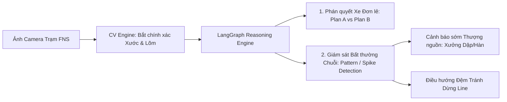

# Product Requirement Document (PRD)
# Visual QC Agent — Automotive Quality Control & Intelligent Routing System (FNS Line)

- **Mã dự án:** P-235 (Team 235)
- **Tên sản phẩm:** Visual QC Agent (Hệ thống Kiểm định Ngoại quan Thông minh & Điều hướng Xe)
- **Trọng tâm kỹ thuật:** Nhận dạng chuyên sâu khuyết tật **Xước (Scratch)** & **Lõm/Móp (Dent)**, Phân cấp lập luận tiêu chuẩn **GD&T / Vật liệu**, Lập kế hoạch xử lý và **Phát hiện Bất thường Chuỗi tránh Dừng Dây chuyền (Line Stoppage Prevention)**.
- **Vị trí áp dụng:** Trạm FNS (Finish Line - Trạm Hoàn thiện Cuối Dây chuyền Lắp ráp Ô tô) — Line HA
- **Tác giả:** PM & PO Team 235
- **Phiên bản:** v1.1 (Cập nhật Tinh chỉnh Phạm vi & Tính năng Phát hiện Bất thường Hệ thống)

---

## 1. Bối cảnh & Tuyên ngôn Bài toán (Problem Statement)

### 1.1. Bối cảnh Sản xuất Ô tô tại Trạm FNS Line
Trạm **FNS (Finish Line)** là chốt chặn chất lượng hoàn thiện trước khi xe ra sân thử nghiệm (Test Drive Track) hoặc xuất xưởng. Chu kỳ kiểm tra (Takt Time) tại trạm cực kỳ nghiêm ngặt: **90 – 120 giây/xe**.

Hai loại khuyết tật ngoại quan phổ biến và gây thiệt hại kinh tế nặng nề nhất là:
1. **Vết Lõm / Móp (Dent):** Biến dạng cơ học do va quẹt, khuôn dập lỗi hoặc robot kẹp sai lực.
2. **Vết Xước (Scratch):** Tổn thương lớp sơn bóng (Clear-coat), sơn lót (Primer) hoặc chạm lớp tôn kim loại.

### 1.2. Nỗi đau (Painpoints) Thực tế
1. **Khó khăn trong đánh giá thủ công:** QC mất 3–5 phút đắn đo xem vết lõm/xước có vượt dung sai GD&T không ($0.7\text{mm} - 1.5\text{mm}$), vị trí đó là **Thép dập nóng** hay **Thép thường**, có được phép buffing không hay phải giữ xe lại.
2. **Rủi ro bẩn vết lỗi khi chạy thử:** Nếu xe bị móp/xước sâu mà vẫn ra sân chạy thử, bụi đất và nước bắn vào vết hở làm hư hại lớp sơn lót, chi phí Rework sau đó tăng gấp 5–10 lần.
3. **Nỗi sợ lớn nhất của nhà máy: DỪNG LINE (Line Stoppage):**
   - Khi một lỗi lõm/xước xuất hiện lặp lại liên tiếp trên nhiều xe (ví dụ: 3–5 xe liên tiếp cùng bị móp ở góc mép cánh cửa trước trái do cối dập dính mạt kim loại ở xưởng Dập/Hàn), việc phát hiện muộn sẽ dẫn đến:
     - Hàng loạt xe bị tắc nghẽn tại trạm FNS Line.
     - Nhà máy buộc phải **DỪNG DÂY CHUYỀN KHẨN CẤP** để tìm nguyên nhân (chi phí dừng chuyền ô tô lên tới hàng chục nghìn USD mỗi giờ).

---

## 2. Định vị Sản phẩm & Giá trị Đột phá (Core Value Proposition)

> **Visual QC Agent = Thị giác Máy tính Tập trung (High-Precision Vision for Scratch & Dent) + Lập luận Chuẩn Công nghiệp (GD&T & Material Reasoning) + Hệ thống Cảnh báo Bất thường Chuỗi Tránh Dừng Line (Systemic Anomaly & Line Stoppage Prevention)**

---

## 3. Chân dung Người dùng (User Personas)

1. **QC Inspector (Kiểm định viên FNS):** Thao tác trực tiếp tại trạm, cần chỉ dẫn điều hướng tức thì trong 2s (**PLAN A: Đánh bóng 3m** hay **PLAN B: HOLD Giữ xe**).
2. **Line Supervisor / Trưởng ca Sản xuất:** Theo dõi bức tranh tổng thể, nhận cảnh báo sớm khi có cụm lỗi lặp lại liên tiếp để kịp thời xử lý thiết bị thượng nguồn, không để line bị ngắt quãng.
3. **Rework Technician (Kỹ thuật viên Sửa chữa):** Tiếp nhận xe Plan B kèm hồ sơ lỗi chi tiết (tọa độ, loại vật liệu, độ sâu móp) để tiến hành khắc phục chính xác.

---

## 4. Ma trận Quyết định & Phân luồng Kỹ thuật (Decision Matrix)

### 4.1. Quy chuẩn GD&T và Cấp độ Nghiêm trọng
- **Dung sai GD&T:** Group 1 (Class A: $\le 0.7\text{mm}$), Group 2 (Tai xe/Mui: $\le 1.0\text{mm}$), Group 3 (Cột A/B/C: $\le 1.2\text{mm}$), Group 4-5 (Gầm/Sàn: $\le 1.5\text{mm}$).
- **Vật liệu:** 
  - *Thép thường (Mild/Galvanized Steel):* Cho phép nắn nguội hoặc đánh bóng nhanh.
  - *Thép dập nóng (Hot Stamped Boron Steel):* Cực cứng, cấm gõ nguội tại trạm.

### 4.2. Ma trận Phân luồng Từng Xe (Individual Vehicle Routing)

| Loại Khuyết tật | Vị trí / Vùng GD&T | Vật liệu Thân vỏ | Severity Rank | Phán quyết Agent | Hành động Điều hướng Thực thi |
| :--- | :--- | :--- | :--- | :--- | :--- |
| **Xước nông / Xước dăm (Scratch)** | Cánh cửa / Cột (Group 2–4) | Thép thường (Lớp sơn bóng) | **Rank C / D** | **PLAN A** | Đánh bóng (Buffing) 3 phút tại trạm $\rightarrow$ **CHO PHÉP CHẠY THỬ** |
| **Vết móp nông ($\le 0.7\text{mm}$)** | Mui xe / Tai xe (Group 2–3) | Thép thường | **Rank C** | **PLAN A** | Hút chân không/Xử lý nhanh $\rightarrow$ **CHO PHÉP CHẠY THỬ** |
| **Vết móp sâu ($> 0.7\text{mm}$)** | Cánh cửa Class A (Group 1) | Thép thường | **Rank A / B** | **PLAN B** | **GẮN NHÃN HOLD $\rightarrow$ CẤM CHẠY THỬ** (Tránh bụi bẩn) $\rightarrow$ Chuyển Rework |
| **Vết móp biến dạng** | Khung cửa Class A (Group 1) | **Thép dập nóng (Hot Stamped)** | **Rank A** | **PLAN B** | **GẮN NHÃN HOLD $\rightarrow$ CẤM CHẠY THỬ**, chuyển xưởng Rework nhiệt |
| **Xước sâu chạm kim loại** | Nắp capo Class A (Group 1) | Mọi vật liệu | **Rank A / B** | **PLAN B** | **GẮN NHÃN HOLD $\rightarrow$ CẤM CHẠY THỬ**, chuyển xưởng Sơn |

---

## 5. Tính năng Đột phá: Giám sát Bất thường Chuỗi & Chống Dừng Line (Systemic Anomaly & Line Stoppage Prevention)

### 5.1. Cơ chế Phát hiện Bất thường Lặp lại (Repetitive Defect Spike Detection)
Hệ thống duy trì một **Sliding Window Buffer** (theo dõi $N = 10$ xe gần nhất qua trạm):
- **Điều kiện kích hoạt Cảnh báo Bất thường (Anomaly Trigger):** Khi phát hiện $\ge 3$ xe liên tiếp (hoặc $\ge 4$ xe trong cửa sổ 10 xe) gặp cùng một loại lỗi (Dent hoặc Scratch) tại cùng một vùng tọa độ không gian (cùng GD&T Zone).
- **Phân tích Nguyên nhân Gốc rễ Dự đoán (Predicted Root Cause):**
  - Cụm vết móp cùng tọa độ $\rightarrow$ *Dự đoán: Khuôn dập (Stamping Die) dính bavia/mạt kim loại hoặc tay gắp robot hàn bị kẹt dị vật.*
  - Cụm vết xước cùng đường kẻ dọc $\rightarrow$ *Dự đoán: Con lăn băng tải hoặc thanh dẫn hướng bị cọ xát.*

### 5.2. Kế hoạch Hành động Điều hướng Chống Dừng Line (Line Stoppage Prevention Plan)
Khi phát hiện bất thường chuỗi, Agent tự động kích hoạt 3 hành động phối hợp:
1. **Phát Tín hiệu Cảnh báo Sớm (Early Warning Broadcast):** Gửi cảnh báo tức thì kèm hình ảnh và tọa độ nghi ngờ lên màn hình Giám sát FNS và Xưởng Thượng nguồn (Xưởng Dập / Xưởng Hàn) để kiểm tra khuôn ngay trong chu kỳ Takt Time tiếp theo.
2. **Kích hoạt Vùng Đệm Điều phối (Buffer Area Dynamic Routing):** Tự động điều hướng các xe bị lỗi thuộc lô bất thường vào làn đệm (Offline Inspection Buffer) thay vì để dồn ứ tại trạm FNS, giúp dây chuyền chính **TIẾP TỤC VẬN HÀNH BÌNH THƯỜNG**, không bị nghẽn (No Bottleneck).
3. **Đề xuất Kế hoạch Khắc phục Hàng loạt (Batch Rework Action Plan):** Nhóm các xe có cùng vị trí lỗi để kỹ thuật viên Rework xử lý theo lô với cùng một bộ dụng cụ/phương pháp, tiết kiệm 40% thời gian sửa chữa.

---

## 6. Yêu cầu Chức năng Chi tiết (Functional Requirements)

### 6.1. Module 1: High-Precision Vision Engine (Scratch & Dent)
- **FR-01:** Tiếp nhận hình ảnh trạm FNS, tập trung tối đa mô hình nhận diện khuyết tật vào 2 lớp: `scratch` và `dent`.
- **FR-02:** Trích xuất chính xác Bounding Box, độ sâu móp ước tính (`estimated_depth_mm`), diện tích tổn thương và vị trí tọa độ vùng thân vỏ (`zone_name`).

### 6.2. Module 2: Industrial Domain Reasoning & Routing Engine (LangGraph)
- **FR-03:** Tra cứu quy chuẩn dung sai GD&T (Group 1–5) theo vị trí lỗi.
- **FR-04:** Tra cứu vật liệu thân vỏ (Thép dập nóng vs Thép thường).
- **FR-05:** Phân loại Rank nghiêm trọng (PSLAWBCD) và sinh ra phán quyết điều hướng từng xe (`PLAN A` vs `PLAN B`).
- **FR-06:** Tạo giải trình kỹ thuật (Explainable AI) giải thích nguyên do vì sao xe bị giữ hoặc được phép chạy thử.

### 6.3. Module 3: Sliding-Window Anomaly & Line Stoppage Prevention Engine
- **FR-07:** Cập nhật liên tục trạng thái $N$ xe gần nhất vào Redis/Memory State.
- **FR-08:** Phát hiện mẫu lỗi lặp lại theo không gian và thời gian.
- **FR-09:** Tự động sinh `SYSTEMIC_ANOMALY_ALERT` kèm dự đoán nguyên nhân thiết bị và kích hoạt kịch bản điều phối làn đệm chống dừng line.

### 6.4. Module 4: QC Workstation Touch UI & HITL
- **FR-10:** Hiển thị trực quan thẻ điều hướng cá nhân từng xe (Plan A / Plan B).
- **FR-11:** Hiển thị Banner Cảnh báo Đỏ khẩn cấp khi phát hiện lỗi chuỗi hệ thống kèm đề xuất can thiệp.
- **FR-12:** Hỗ trợ kiểm định viên bấm xác nhận (Confirm), ghi đè (Override), hoặc tra cứu hỏi đáp với Agent.

---

## 7. Chỉ số Đánh giá Hiệu quả (Target KPIs)

| Chỉ số | Mục tiêu |
| :--- | :--- |
| **Độ chính xác nhận diện Xước & Móp (CV mAP@0.5)** | $\ge 90\%$ |
| **Độ chính xác phân luồng Plan A / Plan B** | $\ge 96\%$ |
| **Tỷ lệ phát hiện đúng lỗi bất thường chuỗi (Systemic Anomaly Recall)** | $\ge 98\%$ (Phát hiện sớm trong vòng $\le 3$ xe lỗi) |
| **Thời gian phản hồi toàn trình (Latency)** | $< 2.0\text{ giây/xe}$ |
| **Hiệu quả ngăn chặn dừng line** | Giảm thiểu $100\%$ các ca dừng chuyền do dồn ứ xe lỗi tại trạm FNS |
