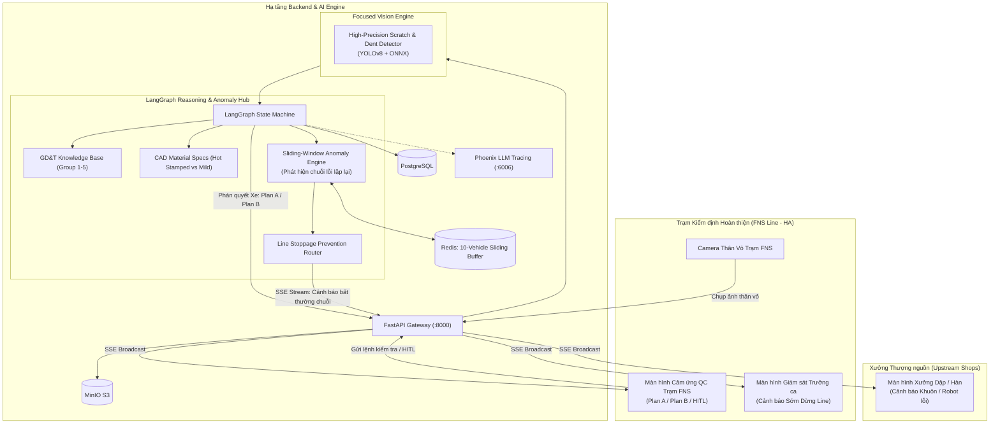
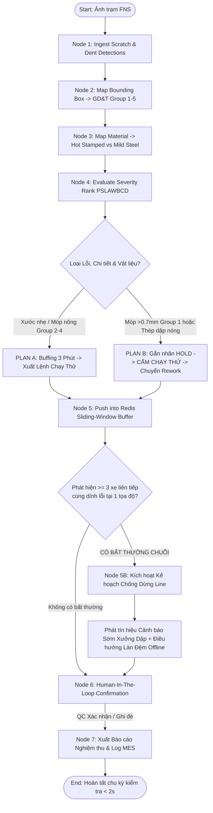

# Architecture Diagrams — Visual QC Agent (Team 235)

---

## 1. End-to-End System Topology (With Systemic Anomaly Prevention)

```mermaid
graph TB
    subgraph Station["Trạm Kiểm định Hoàn thiện (FNS Line - HA)"]
        Cam["Camera Thân Vỏ Trạm FNS"]
        QC_UI["Màn hình Cảm ứng QC Trạm FNS<br/>(Plan A / Plan B / HITL)"]
        Supervisor_UI["Màn hình Giám sát Trưởng ca<br/>(Cảnh báo Sớm Dừng Line)"]
    end

    subgraph Upstream["Xưởng Thượng nguồn (Upstream Shops)"]
        StampingShop["Màn hình Xưởng Dập / Hàn<br/>(Cảnh báo Khuôn / Robot lỗi)"]
    end

    subgraph Server["Hạ tầng Backend & AI Engine"]
        API["FastAPI Gateway (:8000)"]
        
        subgraph VisionService["Focused Vision Engine"]
            CV_Infer["High-Precision Scratch & Dent Detector<br/>(YOLOv8 + ONNX)"]
        end
        
        subgraph AgentService["LangGraph Reasoning & Anomaly Hub"]
            LG["LangGraph State Machine"]
            GDT_KB["GD&T Knowledge Base (Group 1-5)"]
            MAT_KB["CAD Material Specs (Hot Stamped vs Mild)"]
            AnomalyEngine["Sliding-Window Anomaly Engine<br/>(Phát hiện chuỗi lỗi lặp lại)"]
            LineProtector["Line Stoppage Prevention Router"]
        end
        
        RedisState[(Redis: 10-Vehicle Sliding Buffer)]
        DB[(PostgreSQL)]
        MinIO[(MinIO S3)]
        PhoenixNode["Phoenix LLM Tracing (:6006)"]
    end

    Cam -->|Chụp ảnh thân vỏ| API
    QC_UI -->|Gửi lệnh kiểm tra / HITL| API
    API --> MinIO
    API --> VisionService
    VisionService --> LG
    LG --> GDT_KB & MAT_KB
    LG --> AnomalyEngine
    AnomalyEngine <--> RedisState
    AnomalyEngine --> LineProtector
    LG --> DB
    LG -.-> PhoenixNode
    
    LG -->|Phán quyết Xe: Plan A / Plan B| API
    LineProtector -->|SSE Stream: Cảnh báo bất thường chuỗi| API
    API -->|SSE Broadcast| QC_UI & Supervisor_UI & StampingShop
```

---

## 2. LangGraph State Flow & Anomaly Detection Pipeline

```mermaid
graph TD
    StartNode([Start: Ảnh trạm FNS]) --> IngestNode[Node 1: Ingest Scratch & Dent Detections]
    
    IngestNode --> QueryGDT[Node 2: Map Bounding Box -> GD&T Group 1-5]
    QueryGDT --> QueryMat[Node 3: Map Material -> Hot Stamped vs Mild Steel]
    QueryMat --> ComputeRank[Node 4: Evaluate Severity Rank PSLAWBCD]
    
    ComputeRank --> DecisionBranch{Loại Lỗi, Chi tiết & Vật liệu?}
    
    DecisionBranch -->|Xước nhẹ / Móp nông Group 2-4| PlanA[PLAN A: Buffing 3 Phút -> Xuất Lệnh Chạy Thử]
    DecisionBranch -->|Móp >0.7mm Group 1 hoặc Thép dập nóng| PlanB[PLAN B: Gắn nhãn HOLD -> CẤM CHẠY THỬ -> Chuyển Rework]
    
    PlanA --> PushBuffer[Node 5: Push into Redis Sliding-Window Buffer]
    PlanB --> PushBuffer
    
    PushBuffer --> CheckSpike{Phát hiện >= 3 xe liên tiếp<br/>cùng dính lỗi tại 1 tọa độ?}
    
    CheckSpike -->|Không có bất thường| HITL[Node 6: Human-In-The-Loop Confirmation]
    
    CheckSpike -->|CÓ BẤT THƯỜNG CHUỖI| AnomalyNode[Node 5B: Kích hoạt Kế hoạch Chống Dừng Line]
    AnomalyNode --> BroadcastAlert[Phát tín hiệu Cảnh báo Sớm Xưởng Dập + Điều hướng Làn Đệm Offline]
    BroadcastAlert --> HITL
    
    HITL -->|QC Xác nhận / Ghi đè| GenerateReport[Node 7: Xuất Báo cáo Nghiệm thu & Log MES]
    GenerateReport --> EndNode([End: Hoàn tất chu kỳ kiểm tra < 2s])
```
