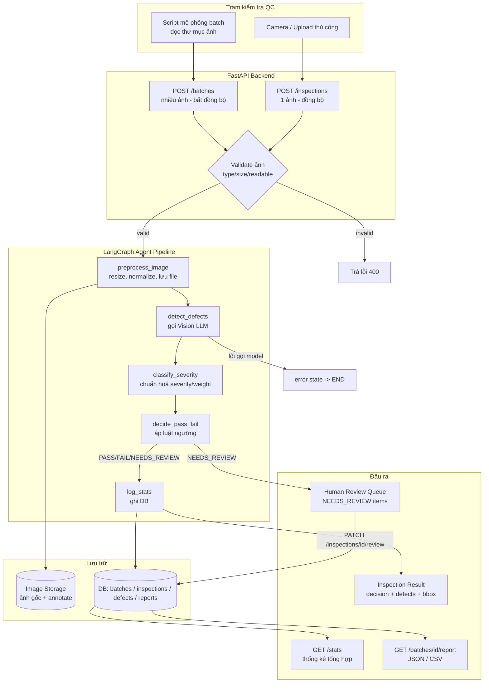

# Architecture Diagram — Visual QC Agent

## Luồng dữ liệu ảnh: từ trạm kiểm tra đến báo cáo

## Ghi chú luồng
- **Đường đồng bộ (single image)**: Station → `POST /inspections` → agent chạy hết pipeline → trả `RESULT` ngay trong response HTTP.
- **Đường bất đồng bộ (batch)**: Station/script → `POST /batches` → tạo `batch_id`, xử lý nền (BackgroundTasks) từng ảnh qua pipeline → client poll `GET /batches/{id}` cho tới `status=done` → gọi `GET /batches/{id}/report`.
- **Nhánh lỗi**: ảnh không hợp lệ hoặc lỗi gọi vision LLM đều dừng sớm ở agent, ghi `error` vào state, không đi tiếp qua các bước phân loại/quyết định, tránh ghi nhận sai lệch vào thống kê.
- **Nhánh review**: mọi kết quả `NEEDS_REVIEW` vẫn được ghi nhận vào DB như bình thường (không chặn pipeline), nhưng được đưa vào hàng đợi review riêng ở tầng ứng dụng/UI; khi Reviewer xác nhận, `PATCH /inspections/{id}/review` cập nhật lại `decision` cuối cùng trong DB.

## Xem thêm
- Chi tiết state schema, node/tool, API endpoints: [`../ARCHITECTURE.md`](../ARCHITECTURE.md)
- Yêu cầu chức năng, taxonomy lỗi, luật quyết định: [`../document/PRD.md`](../document/PRD.md)
